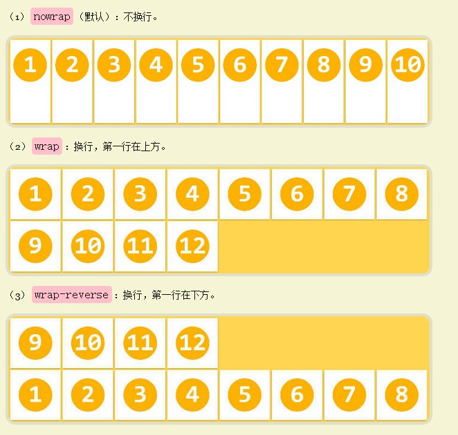

# CSS

## 选择器

### 元素之间的关系

- ​	父元素：直接包含子元素的元素
- ​	子元素：直接被父元素包含的元素
- ​	祖先元素：直接或间接包含后代元素的元素，父元素也是祖先元素
- ​	后代元素：直接或间接被祖先元素包含的元素，子元素也是后代元素
- ​	兄弟元素：拥有相同父元素的元素

### 常用选择器

- 元素选择器：`div{} p{} span{}`
- 类选择器：`.content{} .myBtn{}`
- id选择器：`#mySpan{} #myDiv{}`
- 后代选择器：`div .content #myBtn`
- 子选择器：`div > .myBtn{}`
- 相邻同辈选择器：`h2 + p{}` 
- 一般同辈选择器：`h2 ~ p{}`
- 并集选择器： `div,.content,#myBtn{}` 
- 交集选择器：`div#myBtn{}`
- 通用选择器：` *{}`
- 属性选择器：`p[title]`

### 伪类和伪元素

两者的区分：

伪类的效果可以通过添加一个实际的类来达到，而伪元素的效果则需要通过添加一个实际的元素才能达到，这也是为什么他们一个称为伪类，一个称为伪元素的原因。 css3规定，伪类使用`:`，伪元素使用了`::`。

常用的伪元素

- `::before`
- `::after`
- `::first-letter`

常用的伪类

- `:link`
- `:visited`
- `:hover`
- `:active`
- `nth-child`
- `:required`

### 样式继承和优先级

样式的继承
在css中，祖先元素上的样式，也会被他的后代元素所继承。但是并不是所有的样式都会被子元素继承，比如背景相关的样式。但背景颜色默认为透明。

选择器的优先级

- 内联样式，优先级：1000
- id选择器，优先级：100
- 类和伪类，优先级：10
- 元素选择器，优先级：1
- 通配*，优先级：0
- 继承的样式，没有优先级
- 当选择器中包含多个选择器时，需要将多种选择器的权重相加然后在比较；如果选择器的优先级一样，就选择顺序在后面的
- a元素的四个伪类的优先级，link,visite,hover,active,这四个伪类的优先级是一样的，所以要按LVHA这个顺序去编写

## 盒模型

> 内容区(content)，内边距(padding)， 边框(border)

### 盒子大小的计算

计算方式以width为例：

标准盒模型：`width = content `

IE盒模型：`width = content + Rborder + Lborder + Rpadding + Lpadding`

可以通过`box-sizing`来改变盒模型的计算方式，`content-box`表示标准，`border-box`表示IE

### 元素（盒子）的分类

块级元素(block)：

- 会独占一行,默认情况下,其宽度自动填满其父元素宽度，但默认不会继承父元素的高度
- 可以设置width,height属性，设置了宽度仍然是独占一行.
- 可以设置margin和padding属性.
- 常用的块元素：`div`，`p`，`h1` ，`h2`，`ul` ，`li` 

行内元素(inline)：

- 不会独占一行,相邻的行内元素会排列在同一行里,直到一行排不下,才会换行
- 行内元素设置width,height属性无效，它的宽高主要根据内容决定.
- margin仅左右有效
- 常用的行内元素：`span `，`a `，`strong `，`em` ，`b `，`s `，`i` ，`font`

行内块元素(inline-block)：

- 在拥有行内元素的特性时（如不会独占一行），可以设置宽高，margin和padding可以和block一样设置。
- 常用的行内块元素：`img`，`input`

转换：

通过display可以改变元素的类别

- `display: block`
- `display: inline`
- `display: inline-block`

### 外边距折叠

垂直方向上的两个外边距相遇时，会折叠成功一个外边距。折叠后外边距的高度等于两者中较大的那一个高度。

三种相遇折叠的情况（以上边距为例）

- 上方元素和下方元素相遇
- 元素的上外边距和父元素的上外边距相遇

外边距折叠只发生在文档常规文本流中块级盒子的垂直方向。行内盒子，浮动盒子或者绝对定位盒子的外边距都不会发生折叠。

### 定位

>如果元素的定位方式为静态定位（未设置position属性）或者相对定位，则其包含块的边界就计算到一个最近的符合要求的父元素，默认情况下，width，margin，padding的值为百分比的时候，就以该父元素的**宽度**进行计算。（是的，上下内外边距都是基于父元素的宽计算的）

> 当开启元素的定位以后(即元素position的值不是static)时，可以通过left、right、top、bottom四个属性来设置元素的偏移量。偏移量为百分比时，参考对象是父元素的宽高

#### 相对定位

当元素`position`属性设置为`relative`时，则开启了元素的相对定位

开启相对定位后的特点：

1. 当开启了元素的想对定位以后，而不设置偏移量时，元素不会发生任何的变化
2. 相对定位是相对于元素在文档流中原来的位置而言
3. 相对定位的元素不会脱离文档流
4. 相对定位会使元素提高一个层级
5. 相对定位不会改变元素的性质。 

#### 绝对定位

当元素`position`属性设置为`absolute`时，则开启了元素的绝对定位	

开启绝对定位后的特点：

1. 当元素开启绝对定位以后，元素会脱离文档流。
2. 开启绝对定位以后，如果不设置偏移量，元素的位置不变
3. 绝对定位是相对于离他最近的开启了定位的祖先元素进行定位了(一般开启了子元素的绝对定位，也会开启祖先元素的相对定位)。如果所有的祖先元素都没有开启定位，则会相对浏览器窗口进行定位。
4. 绝对定位会使元素提高一个层级
5. 对定位会改变元素的性质。
6. 块开启绝对定位以后，倘若父元素没有开启相对定位，那么这个块是相对于浏览器进行定位，倘若这个块的长和块设置的是%，那么这个%也是相对于浏览器，而不是相对于父元素的。此时父元素的overflow对子元素也不会起作用（应该，未百分之百确定）

#### 固定定位

元素`position`属性设置为`fixed`时，则开启了元素的固定定位，固定定位是一种特殊的绝对定位，和绝对定位不同的是，固定定位永远相对于浏览器窗口进行定位。且固定定位会固定在浏览器窗口的某一个位置，不会随着滚动条滚动。

#### 浮动

### 文本

#### 行间距

每行文本都是一个行内盒子，行内盒子的高度等于行高（行间距）。可以通过`line-height`来设置行高。

倘若line-hegit设置为30px，font-size为20px，上/下间距的高度 = (line-height 减去 font-size) / 2;

#### 基线

基线的位置并不是固定的：

- 在文本之类内联元素中，基线是字符x的下边缘位置
- 在像`img`元素中基线就是下边缘
- 在`inline-block`元素中，也分两种情况
  1. 如果该元素中有内联元素，基线就是最后一行内联元素的基线。
  2. 如果该元素内没有内联元素或者overflow不是visible，其基线就是margin的地边缘。

#### 垂直对齐

`vertical-align`是用来设置`行内元素`对齐方式的。就是display属性值为`inline`、`inline-block`、`inline-table`另加一个`table-cell`的元素，可能会增加行内盒子的高度

## 布局

### flex布局

> flex是flexible Box弹性布局，给盒模型提供最大的灵活性的一种布局方式

#### 基本概念

- flex container：采用flex布局的元素叫做flex container
- flex items：flex container的所有子元素分别都是一个flex item
- main axis：主轴可以理解为X轴（注意坐标轴的元点是在左上角），主轴开始的地方叫做main start，结束的地方叫做main end。flex items默认从main axis开始的地方向结束的地方排列
- cross axis：交叉轴可以理解为y轴，交叉轴开始的地方叫做cross start，结束的地方叫做cross end
- 

#### flex container的6个属性

- flex-direction:控制主轴的方向

  - 取值有：

    - `row`（默认值）：主轴为水平方向，起点在左端。

    - `row-reverse`：主轴为水平方向，起点在右端。

    - `column`：主轴为垂直方向，起点在上沿。

    - `column-reverse`：主轴为垂直方向，起点在下沿。

  - 

- justify-content:决定了item在主轴上面的对齐方式

  - 取值
    - ​    `flex-start`（默认值）：左对齐
    - ​    `flex-end`：右对齐
    - ​    `center`： 居中
    - ​    `space-between`：两端对齐，项目之间的间隔都相等。
    - ​    `space-around`：每个项目两侧的间隔相等。所以，项目之间的间隔比项目与边框的间隔大一倍。
  - 

- align-items:决定了item在交叉轴上面的对齐方式

  - 取值有：

    - `flex-start`：交叉轴的起点对齐。

    -  `flex-end`：交叉轴的终点对齐。

    -  `center`：交叉轴的中点对齐。

    -   `baseline`: 项目的第一行文字的基线对齐。

    -   `stretch（默认值）`：如果项目未设置高度或设为auto，将占满整个容器的高度。倘若item设置了高度，那么item就会呈现flex-start的效果。

  - 

       

- align-content：决定了多行item在交叉轴上的对齐方式，用法类似于justify-content。当item只有一行的时候，这个属性是不起效果的

  - 取值有：

    - `flex-start`：与交叉轴的起点对齐。
    - `flex-end`：与交叉轴的终点对齐。
    - `center`：与交叉轴的中点对齐。

    - `space-between`：与交叉轴两端对齐，轴线之间的间隔平均分布。

    - `space-around`：每根轴线两侧的间隔都相等。所以，轴线之间的间隔比轴线与边框的间隔大一倍。

    - `stretch`（默认值）：轴线占满整个交叉轴。

  - 

- flex-wrap：当container的一行容不下所有的item时，item采用那种方式排列到下一行

  - 取值有：	
    - nowrap：不换行，每个item会自动缩小，以容纳全部
    -  wrap：换行，第一行在上方
    - wrap-reverse：换行，第一行在下方
  - 

- flex-flow：是flex-direction和flex-wrap的缩写

#### flex items的6个属性

- order：决定item的排序顺序，值越小，排在越前面，默认为0 ，可以为负
  - 
- align-self：决定item的对齐方式。我们通过给container设置align-items来决定item在交叉轴上的对齐方式，可以通过给item设置align-self来单独给某一个item设置它在交叉轴上的对齐方式即align-self会覆盖align-items。
  - 默认值为`auto`，表示继承父元素的`align-items`属性，如果没有父元素，则等同于`stretch`。除了auto，其他都与align-items属性完全一致。
  - 
- flex-grow：决定了item如何扩展，只有当container在主轴方向上有剩余的size时，grow才会生效。
  - 情况1，当所有的item的grow总和超过的了1，每个item扩展的size为container剩余的size*（grow/sum）
  - 情况2，当所有的item的grow总和小于等于1，每个item扩展的size为container剩余的size*grow
  - item扩展后的size不可以超过当前item所设置的max-width或max-height
- flex-shrink:决定了item的缩小比例，默认为1 ，只有当container在主轴方向上的size不够的时候，shrink才会生效。
  - 情况1：当所有item的shrink总和超过了1，每个item收缩的size为超过container的size*（shrink/sum）
  - 情况2：当所有item的shrink总和小于等于1，每个item收缩的size为超过container的size*shrink
  - item收缩后的size不可以超过当前item所设置的min-width或min-height，文字所占据的width就是一种默认的min-width
- flex-basis：设置item在主轴方向上的base size，它的默认值为auto，即item的本来大小
  - 比较少使用，基本直接设置item的width属性
  - 当item同时设置了多种类型的宽度时：max-width/mix-width > flex-basis > width > item中内容本身的size 
- flex：flex属性是flex-grow, flex-shrink 和 flex-basis的简写，默认值为0 1 auto。后两个属性可选

#### 关于flex布局下，item的压缩

- 普通的item
  - 若父元素(container) 的宽度固定，item在没有设置其他属性的情况下，item是平分container宽度的。
- 容纳文字的item
  - 若你的item没有设置宽度，那么iten的宽度由文字撑开，浏览器会根据文字的字数自动调整文字占据的宽度。所有此时item的宽度由文字的字数决定。
  - 若你的item设置了宽度，那么文字的显示将不会超过这个宽度，容纳不下的文字将向下排列即超出item的高度
- 容纳图片的itme
  - 当图片设置了宽度时，此时item的宽度就是图片的宽度。当所有item中图片的宽度和会大于container的宽度时，此时会超度container的宽度而不是缩小item

## 图片

## 文字

