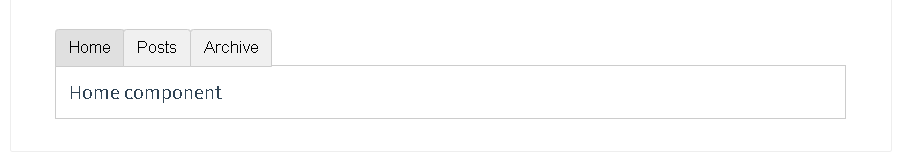
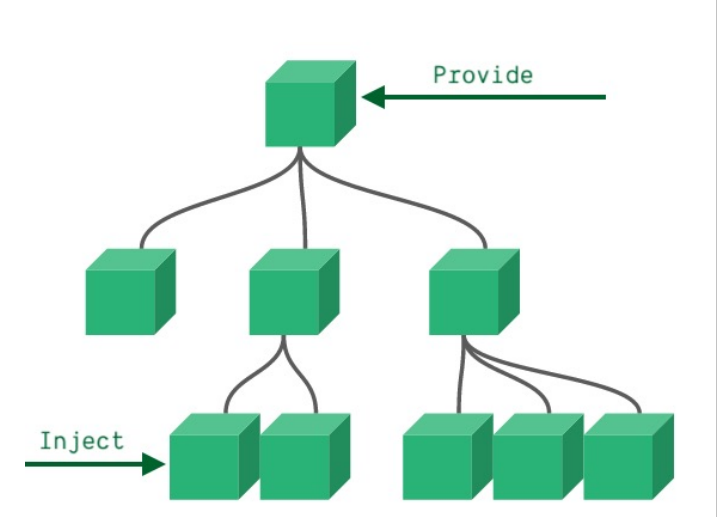
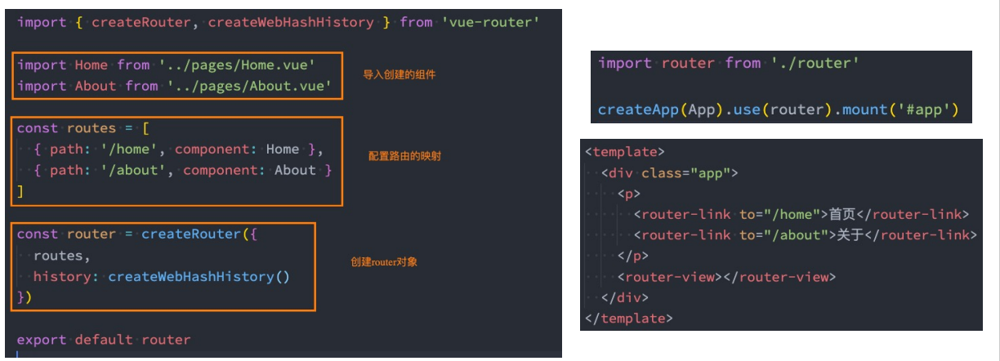
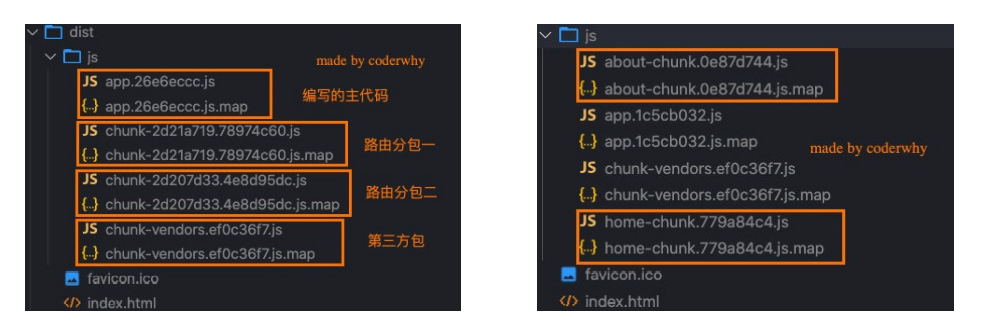
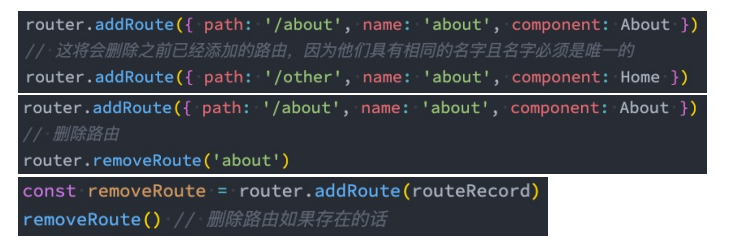

# Vue的基本语法

## 一.Vue常用的修饰符

### v-bind

> 给属性绑定一个变量，然后就可以动态修改属性的值。

- 基本绑定

  ```html
  
  <!-- 语法糖的写法 -->
  <!-- v-bind不支持驼峰，所以要将驼峰转换，abcMad转换成abc-mad -->
        
  ```

- 动态绑定class

  直接绑定一个类名（意义不大）

  - active2：active2是一个变量，存放了class的值 

  对象语法

  class绑定一个对象或者绑定一个返回对象的函数。

  - {active:isActive,line:isLine}：此时的active是class的名字，isActive是boolean类型的变量
  - getClass()：该函数返回一个对象

  数组语法

  class绑定一个数组，数组有两种值

  - 字符串：['active','line']，此时的active是class的名字。
  - 变量：[activeArr,lineArr]，此时的activeArr是存放了class值的变量。

  ```html
  
  <style>
      .active{
          color: red;
      }
      .line{
          font-weight: 200;
      }
  </style>
  
  <div id="app">
      <h2 :class="active2">hello</h2>
      <h2 class="title"   :class="{active:isActive,line:isLine}">hello</h2>
      <h2 :class="getClass()">hello</h2>
      <button v-on:click=" btnIsActive">修改</button>
      
      <h2 class="title" :class="['active','line']">hello</h2>
      <h2 class="title" :class="[activeArr,lineArr]">hello</h2>
  </div>
  <script src="../js/vue.js"></script>
  <script>
      const app = new Vue({
          el: "#app", 
          data: { 
              message:"hellow vue",
              isActive:true,
              isLine:true,
              active2:"active"
              activeArr:"active",
          	lineArr:"line"
          },
          methods: {
              btnIsActive:function(){
                  this.isActive = !this.isActive
              },
              getClass:function(){
                  return {active:this.isActive,line:this.isLine}
              }
          }
      })
  </script>
  ```

  

- 动态绑定style

  - 对象语法
  - 数组语法

  ```html
  <style>
      .active{
        color: red;
      }
      .line{
        font-weight: 200;
      }
    </style>
  </head>
  <body>
    <div id="app" v-cloak>
      <!-- <h2 :style="{key(属性名):value(属性值)}">{{message}}</h2> -->
      <h2 :style="{fontSize:'25px'}">{{message}}</h2>
      <!-- 有-的，按驼峰规则改写 -->
      <h2 :style="{fontSize:number}">{{message}}</h2>
      <h2 :style="{fontSize:number2 + 'px' , color:color}">{{message}}</h2>
       <h2 :style="[style,style2]">{{message}}</h2>
    </div>
    <script src="../js/vue.js"></script>
    <script>
        const app = new Vue({
        el: "#app", 
        data: { 
          message:"hellow vue",
          number:"50px",
          number2:50,
          color:"red",
          style:{fontWeight:"800"},
          style2:{color:"yellow"}
        },
        methods: {
        }
       })
      
    </script>
  ```

  

### v-on

> 给相应的dom元素绑定监听事件的

```html
  	<button v-on:click="add">+</button>
    <button v-on:click="sub">-</button>
    <!-- 语法糖的写法，将v-on:简写成@ -->
    <!-- 事件监听的时候,且不用传递参数,那么此时后面可以不用添加() -->
    <button @click="add">+</button>
    <button @click="sub()">-</button>
```

------

事件绑定时的传参问题

```html
<!-- 在事件定义的时候，写方法时省略了小括号，但方法本身需要一个参数，这个时候，vue会自动将浏览器
生产的event对象，作为参数传递进去 -->
<button @click="fun">自动传入event</button>

<!-- 在函数本身需要abc和event事件的时候，不传递参数，那么第一个参数是event，第二个参数的undefined -->
<button @click="fun2">要abc</button>

<!-- 想传递event事件，那么需要写成$event -->
<button @click=" fun2(‘abc’,$event)">有abc</button>
```

------

事件绑定的修饰符问题

- .stop：阻止事件的冒泡，点击子元素，不会触发父元素的点击事件

  <button @click.stop="fun2">按钮1</button>

- .prevent：阻止默认事件，如超链接有一个默认事件就是点击后会自动进行跳转。

- capture

- .once ：添加了这个关键字以后，这个函数只会执行一次

------

监听键盘事件：@键盘事件.某个按键，对于elementUI的input，我们需要在后面加上.native, 因为elementUI对input进行了封装，原生的事件不起作用。

```html
<input type="text" @keyup.enter="fun3">
<el-input v-model="form.name" placeholder="昵称" @keyup.enter.native="submit"></el-input>
```


### v-if，v-else

>用于控制dom元素是否在页面上出现

基本使用

```html
 <h1 v-if="isShow">message</h1>
 <h1 v-else>{{message}}</h1>
```

用户登录案例

```html
<div id="app">
    <span v-if="isUser">
    <label for="userName">用户账号</label>
    <input type="text" id="userName" placeholder="用户账号" key="userName">
    </span>
    <span v-else>
    <label for="userEmail">用户邮箱</label>
    <input type="text" id="userEmail"  placeholder="用户邮箱" key="userEmail">
    </span>
    <button @click="change">切换</button>
</div>

<script>
    const app = new Vue({
        el: "#app", 
        data: { 
            isUser:true,
        },
        methods: {
            change(){
            	this.isUser = !this.isUser;
            }
        }
    })
</script>
```

案例存在的问题：

​	 问题：当用户在文本框输入内容以后，在进行切换，明明已经切换了，但输入框中的内容依旧没有改变 

​    原因：vue在进行虚拟dom元素渲染的时候，处于对性能的考虑，会尽可能的复用已经存在的元素，而不是创建					 新的元素 

   解决方法：添加一个关键字key，倘若两个元素的key是相同的，那么就会复用，不一样就不复用 

------

v-if和v-show

- 相同点：都可以隐藏dom元素
- 不同点：
  - 手段：v-if是通过控制dom节点的存在与否来控制元素的显隐；v-show是通过设置DOM元素的display样式，block为显示，none为隐藏；
  - 编译过程：v-if切换有一个局部编译/卸载的过程，切换过程中会合适地销毁和重建内部的事件监听和子组件；v-show只是简单的基于css切换
  - 编译条件：v-if是惰性的，如果初始条件为假，则什么也不做；只有在条件第一次变为真时才开始编译;    v-show是在任何条件下都被编译。
  - 性能消耗：v-if有更高的切换消耗；v-show有更高的初始渲染消耗；
- 两者的使用场景：如果需要非常频繁地切换，则使用 v-show 较好；如果在运行时条件很少改变，则使用 v-if 较好。

### v-for

> 用于html界面上的循环遍历操作

基本操作

```html
<!-- 遍历数组 -->
<div id="app">
    <ul>
        <!-- 在遍历的过程中没有使用index -->
        <li v-for="item in moves">{{item}}</li>
    </ul>
    <ul>
        <!-- 在遍历的过程中使用index -->
        <li v-for="(item,index) in moves">{{index + 1}}{{item}}</li>
    </ul>
</div>
<script src="../js/vue.js"></script>
<script>
    const app = new Vue({
        el:"#app",  
        data:{ 
            message:"你好",
            moves:["星际创月","泰坦尼克","海王","盗梦空间"],
        }
    })
</script>
```

```html
<!-- 遍历对象 -->
<div id="app">
    <ul>
        <!--将原来的数组，改成对象，item代表的就是对象中的每一个属性 -->
        <li v-for="item in info">{{item}}</li>
    </ul>
    <ul>
        <!-- 这个时候的key就是属性名 -->
        <li v-for="(item,key) in info">{{key}}{{item}}</li>
    </ul>
    <ul>
        <!-- 这个时候的index就是属性名的顺序 -->
        <li v-for="(item,key,index) in info">{{index}}{{key}}{{item}}</li>
    </ul>
</div>
<script>
    const app = new Vue({
        el:"#app",  
        data:{ 
            info:{
                name:"gl",
                age:18,
                address:"428"
            }
        }
    })
</script>
```

------

循环中绑定key的重要性：

 没有key时， 当要动态插入时，vue会像链表插入数据那样，去修改虚拟dom，然后映射到当页面上。有key以后，就可以采用diff算法来更加高效的插入，所以给每一个绑定一个独一无二，不容易改变的key 。

```html
  <li v-for="(item,index) in moves" :key="item">{{index + 1}}{{item}}</li>
```

------

v-if和v-for不建议同时在一个标签上使用：

- 当同时出现在同一标签内,可以通过`vue.$options.render`打印出渲染函数，可以清晰的看到会优先执行for循环，再执行if判断。即无论if是否为真，for循环都会执行，浪费性能
- 当v-if出现在父级中，子级有v-for，此时再打印`vue.$options.render`，会发现会优先执行if判断。
- 官网也并不推荐我们两者同时使用，我们可以选择使用computed过滤掉列表中不需要显示的项目,或者两者分别作用在不同元素上（在外层包裹`template`，`template`不会在页面渲染生成`dom`节点）。

```html
<div>
	<div v-for="(user,index) in activeUsers" :key="user.index" >
		{{ user.name }} 
	</div>
</div>

<div>
    <template v-if="xxxx">
        <div v-for="xxxx" :key="xxxx" >
		{{xxxx}} 
		</div>
    </template>
</div>

<script>
    data () {  // 业务逻辑里面定义的数据
        return {
            users,: [{
                name: '111111',
                isShow: true
            }, {
                name: '22222',
                isShow: false
            }]
        }
    }
    computed: {
        activeUsers: function () {
            return this.users.filter(function (user) {
                return user.isShow;//返回isShow=true的项，添加到activeUsers数组
            })
        }
    }
</script>


```


### v-model

> v-model实现了数据的双向绑定，本质上是v-bind和v-on结合的语法糖。

基本使用

```html
<input type="text" v-model="message">{{message}}

<script>
    const app = new Vue({
        el:"#app",  
        data:{ 
            message:"你好",
        }
    })
</script>
```

v-model的修饰符

- .lazy：双向绑定是实时监听，调用频繁，添加关键字lazy以后，会在敲击回车或者失去焦点以后进行更新
- .trim：自动过滤用户输入的首尾空格
- .number：v-model会将绑定的数据变成string，哪怕这个属性最开始定义的是一个number类型，添加了number以后，就会将其绑定的类型改成number类型

------


### v-once，v-html，v-pre，v-cloak

> 功能简单且不常用的一些标签

- v-once：有v-once的{{}}，只会显示初始值

  ```html
  <h1 v-once>{{firstName}}</h1>
  <!--无论变量firstName后面如何改变，显示的值都不变 -->
  ```

  

- v-html：倘若返回的变量的html代码片段的话，使用v-html可以将其html代码片段进行解析

  ```html
  <div id="app">
      <h1 v-html="url"></h1>
    </div>
  
    <script>
      const app = new Vue({
        el: "#app", 
        data: { 
          message:"hellow vue",
          url:"<a href='http://www.baidu.com'>百度</a>"
        },
        methods: {
        }
      })
    </script>
  ```

  

- v-pre：将{{变量名}}展示出来，不会做任何解析

- v-cloak：可以使用 v-cloak 指令设置样式，这些样式会在 Vue 实例编译结束时，从绑定的 HTML 元素上被移除。当网络较慢，网页还在加载 Vue.js ，而导致 Vue 来不及渲染，这时页面就会显示出 Vue 源代码。我们可以使用 v-cloak 指令来解决这一问题。

  ```html
    <style>
      [v-cloak]{
        display: none;
      }
    </style>
  
    <div id="app" v-cloak>
      <!--在vue代码块执行前,div有v-cloak这个属性，当vue代码块执行结束后，cloak这个属性会自动清除
        可以根据这个样式设置样式-->
      <!-- 因为代码块是由上至下执行的-->
      <h1 >{{message}}</h1>
    </div>
  
    <script>
      setTimeout(function(){
        const app = new Vue({
        el: "#app", 
        data: { 
          message:"hellow vue",
          url:"<a href='http://www.baidu.com'>百度</a>"
        },
        methods: {
        }
       })
      },2000)
    </script>
  ```

  

## 二.组件

### vue2中组件的注册和使用

#### 注册组件的基本步骤

- 调用Vue.extend()创建组件
- 调用Vue.component()注册组件
- 在Vue实例的作用范围内使用组件

```html

<div id="app">
    <!-- 3. 使用组件 -->
    <my-cpn></my-cpn>
    <my-cpn></my-cpn>
</div>
<!-- 这个组件调用不会执行，因为不在vue的实例范围里面 -->
<my-cpn></my-cpn>

<script>
    // 但以下构造组件的方式，在vue.2x中几乎看不到，目前都采用语法糖的写法
    // 1.创建组件构造器
    const cpnC = Vue.extend({
        template:`
          <div>
            <h1>你好</h1>
            <h1>hello</h1>
            <h1>world</h1>
    </div>`
    });
    // 2.注册组件,第一个参数是你给组件取的名字，第二个参数是组件构造器（注册的是全局组件）
    Vue.component("my-cpn",cpnC);
    const app = new Vue({
        el:"#app",  
        data:{ 
            message:"你好",
        }
    })
</script>
```

#### 全局组件和局部组件

```html

<div id="app">
    <mycpn></mycpn>
</div>
<div id="app2"> 
    <!-- 实例app2中,无法使用app中注册的组件 -->
    <mycpn></mycpn>
</div>

<script src="../js/vue.js"></script>
<script>
    const cpnC = Vue.extend({
        template:`
          <div>
            <h1>你好</h1>
            <h1>hello</h1>
            <h1>world</h1>
    </div>`
    });
    const app = new Vue({
        el:"#app",  
        data:{ 
            message:"你好",
        },
        components:{
            // 1.组件的名字中不能出现-
            // 2.因为HTML标签对大小写不敏感，所以组件的名字应该全是小写。
            mycpn:cpnC
        }
    });
    const app2 = new Vue({
        el:"#app2",  
        data:{ 
            message:"hello",
        }
    })
</script>

```

#### 父组件和子组件

```html

<div id="app">
    <cpn2></cpn2>
    <!-- 这里使用 cpn1时，会现在自己的注册的vue对象(app)中寻找，找到就解析，没有就报错 -->
    <cpn1></cpn1>
</div>
<script src="../js/vue.js"></script>
<script>
    // 1.创建第一个组件构造器(子组件)
    const cpnC1 = Vue.extend({
        template:`
          <div>
            <h1>你好</h1>
            <h1>hello</h1>
            <h1>world</h1>
    </div>`
    });
    // 2..创建第二个组件构造器(父组件)
    const cpnC2 = Vue.extend({
        template:`
          <div>
            <h1>good</h1>
            <h1>好好</h1>
            <h1>啦啦</h1>
            <cpn1></cpn1>
   		 </div>`,
        // 模板中遇到<cpn1></cpn1>，会先在自己的components中去寻找，倘若没有，就去全局中寻找
        components:{
            cpn1:cpnC1
        }
    });
    // 也可以把这个对象看成一个组件，root
    const app = new Vue({
        el:"#app",  
        data:{ 
            message:"你好",
        },
        components:{
            cpn2:cpnC2
        }
    });
</script>

```

在注册cpnC2的时候,遇到了<cpn1></cpn1>，会先在自己的components中去寻找，倘若没有，就去全局中寻找。找到以后，就会把相应的模板(html代码)拼接到cpnC2中，形成完成的cpnC2。所以对于全局的app来说，它压根就不知道cpn1的存在。

#### 组件注册的语法糖

```html

  <div id="app">
    <cpn></cpn>
    <cpn2></cpn2>
  </div>
  <script src="../js/vue.js"></script>
  <script>
    //  语法糖的方法, 其实是自动帮你调用了vue.extend()方法
    Vue.component("cpn", {
      template: `
          <div>
            <h1>全局组件</h1>
            <h1>hello</h1>
            <h1>world</h1>
          </div>`
    });

    const app = new Vue({
      el: "#app",
      data: {
        message: "你好",
      },
      // 语法糖组成局部组件
      components: {
        cpn2: {
          template: `
          <div>
            <h1>局部组件</h1>
            <h1>hello</h1>
            <h1>world</h1>
          </div>`
        }
      }
    })
  </script>

```

#### 组件模板的分离写法

```html
<body>
  <div id="app">
    <cpn2></cpn2>
  </div>
  <!-- 1.通过script来写（不推荐） -->
  <!-- <script type="template" id="cpn">
    <div>
      <h1>你好哇</h1>
      <h1>hello</h1>
      <h1>world</h1>
    </div>
  </script> -->
  <!-- 2.使用template标签 -->
  <template id="cpn">
    <div>
      <h1>你好哇</h1>
      <h1>hello</h1>
      <h1>world</h1>
    </div>
  </template>

  <script src="../js/vue.js"></script>
  <script>
    const app = new Vue({
      el: "#app",
      data: {
        message: "你好",
      },
      // 语法糖组成局部组件
      components:{
        cpn2:{
          template:'#cpn'
        }
      }
    })
  </script>
```

### vue3中组件的注册和使用

### 动态组件

有的时候，在不同组件之间进行动态切换是非常有用的，比如在一个多标签的界面里：



上述内容可以通过 Vue 的 `<component>` 元素加一个特殊的 `is` attribute 来实现：

```html
<!-- 组件会在 `currentTabComponent` 改变时改变 -->
<component v-bind:is="currentTabComponent"></component>
```

在上述示例中，`currentTabComponent` 可以包括

- 已注册组件的名字
- 一个组件的选项对象

#### 使用keep-alive

在上诉例子中，当在这些组件之间切换的时候，Vue每次都是创建一个全新的`currentTabComponent` 实例。你有时会想保持这些组件的状态，以避免反复重新渲染导致的性能问题，此时就可以使用`keep-alive`

```html
<keep-alive>
  <component v-bind:is="currentTabComponent"></component>
</keep-alive>
```

>注意这个 `<keep-alive>` 要求被切换到的组件都有自己的名字，不论是通过组件的 `name` 选项还是局部/全局注册。

### 异步组件

## 三.组件的通信

### 父子组件的通信

父组件向子组件传递消息是通过`props` ，子组件向父组件传递消息是通过`自定义事件 `

**父向子传递**

```html
<body>
    <div id="app">
      <!-- 通过这种方式，把父组件的数据，给予自组件使用 -->
      <cpn :cpnmessage="message" :cpnmoves="moves"></cpn>
    </div>

   <template id="cpnC">
    <div>
     <p>{{cpnmessage}}</p>
     <ul>
       <li v-for="item in cpnmoves">{{item}}</li>
     </ul>
    </div>
   </template>


    <script src="../js/vue.js"></script>
    <script>
      const cpn = Vue.extend({
        template:"#cpnC",
        // 1.数组写法 props:['cpnmessage','cpnmoves']
        // 2.对象写法
        props:{
          // 1.可以进行类型限制
          // cpnmessage:String,
          // cpnmoves:Array
          // 2.提供一些默认值
          cpnmessage:{
            type:String,
            default:"message",
            // 表示在使用cpn这个组件的时候，一定要传递这个参数，否则会报错
            required:true
            // 3.也支持自定义类型
          },
          cpnmoves:{
            type:Array,
            default:[]
          }
        }
      });
        // 也可以把这个对象看成一个组件，root
        const app = new Vue({
            el:"#app",  
            data:{ 
                message:"你好",
                moves:["星际创月","泰坦尼克","海王","盗梦空间"],
            },
            components:{
              // 字面量的增强写法
              cpn
            }
        });
    </script>
</body>
```

**子向父传递**

```html
<body>
    <div id="app">
      <!-- 子组件的自定义事件，绑定父组件的事件 -->
      <cpn @itemclick="cpnClick"></cpn>
    </div>
    
   <template id="cpnC">
    <div>
      <button v-for="item in moves"
              @click="btnClick(item)" >{{item}}</button>
    </div>
   </template>


    <script src="../js/vue.js"></script>
    <script>
      const cpn = Vue.extend({
        template:"#cpnC",
        data(){
          return{
            moves:["星际创月","泰坦尼克","海王","盗梦空间"],
          }
        },
        methods:{
          btnClick(item){
            // 将方法发送出去,emit触发事件
            this.$emit('itemclick',item);
          }
        }
      });
        const app = new Vue({
            el:"#app",  
            data:{ 
                message:"你好",
                
            },
            components:{
              cpn
            },
            methods:{
              cpnClick(item){
                console.log(item)
              }
            }
        });
    </script>
</body>
```

### 父子组件的访问

父组件获取到子组件这个实例，可以直接获取子组件的全部属性，调用子组件的全部方法。

**父访问子**

通过`$children`或`$refs`

```html
<body>
  <div id="app">
    <cpn></cpn>
    <cpn ref="first"></cpn> 
    <cpn></cpn>
    <button @click="btnClick">打印</button>
  </div>
  <template id="cpn">
    <div>你好</div>
  </template>
  <script src="../js/vue.js"></script>
  <script>
    const app = new Vue({
      el:"#app",
      data:{

      },
      methods:{
        btnClick(){
          //$children获取的是这个组件下面的全部的子组件，返回的是一个数组
          console.log(this.$children);
          // refs返回的是一个对象,先在子组件定义一个ref的属性，相当于一个标识
          console.log(this.$refs.first);
          this.$children[0].showMessage();
        }
      },
      components:{
        cpn:{
          template:"#cpn",
          methods:{
            showMessage(){
              console.log("hello")
            }
          }
        }
      }
    })
  </script>
</body>
```

**子访问父**

通过`$parent`

```html
<body>
  <div id="app">
    <cpn></cpn>
  </div>

  <template id="cpn">
    <div> 
      <p>子组件</p> 
      <button @click="btnClick">按钮</button>
      <cpn2></cpn2>
    </div>
  </template>

  <template id="cpn2">
    <div> 
      <p>孙组件</p> 
      <button @click="btnClick2">按钮2</button>
    </div>
  </template>
  <script src="../js/vue.js"></script>
  <script>
    const app = new Vue({
      el:"#app",
      data:{
      },
      methods:{
      },
      components:{
        cpn:{
          template:"#cpn",
          data(){
            return{
              name:"hellow word"
            }
          },
          methods:{
           btnClick(){
             console.log(this.$parent)
           }
          },
          components:{
            cpn2:{
              template:"#cpn2",
              methods:{
                btnClick2(){
                  console.log(this.$parent.name)
                }
              }
            }
          }
        }
      }
    })
  </script>
</body>
```

## 四.组件的边界情况

### 访问元素和组件

在绝大多数情况下，我们最好不要触达另一个组件实例内部或手动操作 DOM 元素。不过也确实在一些情况下做这些事情是合适的。

#### 访问根实例

在每个 `new Vue` 实例的子组件中，其根实例可以通过 `$root` property 进行访问。例如：

```JavaScript
// Vue 根实例
new Vue({
  data: {
    foo: 1
  },
  computed: {
    bar: function () { /* ... */ }
  },
  methods: {
    baz: function () { /* ... */ }
  }
})


// 获取根组件的数据
this.$root.foo

// 写入根组件的数据
this.$root.foo = 2

// 访问根组件的计算属性
this.$root.bar

// 调用根组件的方法
this.$root.baz()
```

对于 demo 或非常小型的有少量组件的应用来说这是很方便的。不过这个模式扩展到中大型应用来说就不然了。因此在绝大多数情况下，强烈推荐使用 [Vuex](https://github.com/vuejs/vuex) 来管理应用的状态。

#### 访问父级组件实例

和 `$root` 类似，`$parent` property 可以用来从一个子组件访问父组件的实例。它提供了一种机会，可以在后期随时触达父级组件，以替代将数据以 prop 的方式传入子组件的方式。具体用法参考`父子组件的访问`一节

在绝大多数情况下，触达父级组件会使得你的应用更难调试和理解，尤其是当你变更了父级组件的数据的时候。当你的项目需要向任意更深层级的组件提供上下文信息时vue推荐`依赖注入`

#### 访问子组件实例

具体用法也参考`父子组件的访问`一节，这里补充`v-for` 搭配 `ref `使用时的注意点

```html
<body>
    <ul>
        <li v-for="(obj,index) in list" :key="index" :ref="index">{{obj}}</li>
    </ul>
    <ul>
        <li v-for="(obj,index) in array" :key="index" :ref="index">{{obj}}</li>
    </ul>
    <button @click="btnClick">点击</button>
    
  <script src="../js/vue.js"></script>
  <script>
    const app = new Vue({
      el:"#app",
      data:{
		list: ["a", "b", "c", "d"],
        array: [1, 2, 3, 4],
      },
      methods:{
        btnClick(){
            this.list.forEach((obj,index,arr) => {
                console.log(this.$refs[index][0].innerText
            })
             this.list2.forEach((obj,index,arr) => {
                console.log(this.$refs[index][1].innerText
            })
        }
      },
    })
  </script>
</body>
```

总结

在同一个组件的模板中, 当一个或者多个 `v-for` 搭配 `ref` 时，想取出对应的 `ref` 指向的(`dom` or `component`)

语法规则是: `this.$refs[当前元素的索引][它是在第几个v-for中循环的]` 。

> `$refs` 只会在组件渲染完成之后生效，并且它们不是响应式的。这仅作为一个用于直接操作子组件的“逃生舱”——你应该避免在模板或计算属性中访问 `$refs`。

#### 依赖注入

`Provide/Inject`用于非父子组件之间共享数据，比如有一些深度嵌套的组件，子组件想要获取父组件的部分内 容；在这种情况下，如果我们仍然将props沿着组件链逐级传递下 去，就会非常的麻烦； 对于这种情况下，我们可以使用 Provide 和 Inject 



**根组件**

```html
<template>
  <div>
    <home></home>
  </div>
</template>

<script>
  import Home from './Home.vue';

  export default {
    components: {
      Home
    },
    provide:{
        name: "why",
        age: 18,
        length:this.names.length,                 //添加上length，是无法成功且会报错的
    },
    data() {
      return {
        names: ["abc", "cba", "nba"]
      }
    },
  }
</script>

```

**父组件**

```html
<template>
  <div>
    <home-content></home-content>
  </div>
</template>

<script>
  import HomeContent from './HomeContent.vue';

  export default {
    components: {
      HomeContent
    }
  }
</script>

```

**孙组件**

```html
<template>
  <div>
    HomeContent: {{name}} - {{age}} - {{length}}
  </div>
</template>

<script>
  export default {
    inject: ["name", "age", "length"],
  }
</script>

```

大多时候，我们希望`provide`中的数据是动态获取，但上述写法中，直接在`provide`中通过this去获取data中的数据是无法成功的。此时可以把`provide`写成函数的形式。

```js
provide(){
    return {
        name: "why",
        age: 18,
        length:this.names.length,
    }
},
```

在倘若我们还想数据是响应式的，在vue3中我们可以使用`computed`函数，在vue2中我们可以在`data中创建响应式对象`，或者通过`Vue.observable`来创建响应式对象

**通过data创建**

```html
<template>
  <div>
    <home></home>
	<button @click="changeInfo"> change</button>
  </div>
</template>


<script>
import Home from './Home.vue';
import { computed } from 'vue';

export default {
    components: {
        Home
    },
    provide:function(){
        return{
            infoObj:this.infoObj,
        }
    },
    data:function(){
        return {
            infoObj:{
                name: "why",
                age: 18,
                length:this.names.length,
            },
            names: ["abc", "cba", "nba"]
        }
    },
    methods:{
        changeInfo(){
            this.names.push('can')
            this.infoObj.name = 'world';
            this.infoObj.length = this.names.length
        }
    }
}
</script>    

```

**通过Vue.observable**

```js
<template>
  <div>
    <home></home>
	<button @click="changeInfo"> change</button>
  </div>
</template>


<script>
import Home from './Home.vue';
import Vue from 'vue';
const infoObj = Vue.observable({ 
    			name: "why",
                age: 18,
                length:this.names.length
			})

export default {
    components: {
        Home
    },
    provide:function(){
        return{
            infoObj:infoObj,
        }
    },
    data:function(){
        return {
            names: ["abc", "cba", "nba"]
        }
    },
    methods:{
        changeInfo(){
            this.names.push('can')
            infoObj.name = 'world';
            infoObj.length = this.names.length
        }
    }
}
</script>   
```

**vue3中的computed**

`computed`函数返回的是一个`ref对象`，孙组件中通过`lengthObj.value`获取值

```html
<template>
  <div>
    <home></home>
    <button @click="changeInfo">+name</button>
  </div>
</template>

<script>
  import Home from './Home.vue';
  import { computed } from 'vue';

  export default {
    components: {
      Home
    },
    provide() {
      return {
        name: "why",
        age: 18,
        lengthObj: computed(() => this.names.length) 
      }
    },
    data() {
      return {
        names: ["abc", "cba", "nba"]
      }
    },
    methods: {
      changeInfo() {
        this.names.push("can");
        console.log(this.names);
      }
    }
  }
</script>

<style scoped>

</style>
```

### 事件总线（EventBus）


### 循环引用

## 五.插槽的使用

<slot>元素作为承载分发内容的出口，可以理解为一个`占位符`，或者说是`子组件暴露的一个让父组件传入自定义内容的接口`。

### 编译作用域

> 规则：父级模板里的所有内容都是在父级作用域中编译的；子模板里的所有内容都是在子作用域中编译的。

```html
<navigation-link url="/profile">
  Clicking here will send you to: {{ url }}
  <!--
  这里的 `url` 会是 undefined，因为其 (指该插槽的) 内容是
  _传递给_ <navigation-link> 的而不是
  在 <navigation-link> 组件*内部*定义的。
  -->
</navigation-link>
```

### 后备内容

可以理解为默认内容，它只会在没有提供内容的时候被渲染

**子组件**

```html
<template>
    <button type="submit">
        <slot></slot>
    </button>
</template>
```

我们可能希望这个 `<button>` 内绝大多数情况下都渲染文本“Submit”。为了将“Submit”作为后备内容，我们可以将它放在 `<slot>` 标签内：

```html
<template>
    <button type="submit">
        <slot>Sumit</slot>
    </button>
</template>
```

**父组件**

```html
<template>
    <div class="father">
        <h3>这里是父组件</h3>
        <child></child>
    </div>
</template>
```

当父组件并没用给子组件提供插槽的内容是，后备内容就会自动渲染出来

### 默认插槽 | 匿名插槽

与具名插槽相对，匿名插槽是无法设置name属性，匿名插槽可以放置在组件的任意位置。因为匿名所以一个组件中只能有`一个`该类插槽。

**子组件**

```html
<template>
    <div class="child">
        <h3>这里是子组件</h3>
        <slot></slot>
    </div>
</template>
```

**父组件**

```html
<template>
    <div class="father">
        <h3>这里是父组件</h3>
        <child>
            <div class="divSlot">
              <span>匿名插槽</span>
            </div>
        </child>
    </div>
</template>
```

父组件传入的 <div class="divSlot"> </div>会取代子组件中的 <slot>。倘若子组件中并没有 <slot></slot>，那么父组件传入的 <div class="divSlot"> </div>就会整个被忽略。

### 具名插槽

与匿名插槽相对，具名插槽就可以有`很多个`，只要名字（name属性）不同就可以了。

**子组件**

```html
<template>
  <div class="child">
      
    <slot name="up"></slot>
      
    <h3>这里是子组件</h3>
      
    <slot name="down"></slot>
      
    <slot></slot>
  </div>
</template>
```

**父组件**

```html
<template>
  <div class="father">
    <h3>这里是父组件</h3>
    <child>
      <div class="divSlot" slot="up">
        <span>具名插槽up</span>
      </div>
        
      <div class="divSlot" slot="down">
        <span>具名插槽down</span>
      </div>
        
      <div class="divSlot">
        <span>匿名插槽</span>
      </div>
    </child>
  </div>
</template>
```

>vue2.6.0为具名插槽和作用域插槽引入了一个新的统一的语法 (即 `v-slot` 指令)。它取代了 `slot` 和 `slot-scope`

### 作用域插槽

其实就是带数据的插槽，父组件可以拿到子组件的数据。子组件可以在slot标签上绑定属性值

**子组件**

```html
<template>
     <div class="child">
        <h3>这里是子组件</h3>
        <slot :user="user"></slot>
    </div>
</template>


<script>
    export default {
        data: function(){
            return {
                user:{
                    firstName:'gu',
                    lastName:'lei'
                }
            }
        }
    }
</script>

```

**父组件**

```html
<template>
    <child>
        <template slot-scope="user">
          {{ user.lastName }}
        </template>
    </child>
</template>
```

`slot-scope` 的值可以接收任何有效的可以出现在函数定义的参数位置上的 JavaScript 表达式。这意味着在支持的环境下 ([单文件组件](https://cn.vuejs.org/v2/guide/single-file-components.html)或[现代浏览器](https://developer.mozilla.org/zh-CN/docs/Web/JavaScript/Reference/Operators/Destructuring_assignment#浏览器兼容))，你也可以在表达式中使用 [ES2015 解构](https://developer.mozilla.org/zh-CN/docs/Web/JavaScript/Reference/Operators/Destructuring_assignment#解构对象)

### 具名插槽(2.6.0后)

> `v-slot` 指令自 Vue 2.6.0 起被引入，提供更好的支持 `slot` 和 `slot-scope` attribute 的 API 替代方案。在接下来所有的 2.x 版本中 `slot` 和 `slot-scope` attribute 仍会被支持，但已经被官方废弃且不会出现在 Vue 3 中。

**子组件**

```html
<template>
  <div class="child">
      
    <slot name="up"></slot>
      
    <h3>这里是子组件</h3>
      
    <slot name="down"></slot>
      
    <slot></slot>
  </div>
</template>
```

一个不带 `name` 的 `<slot>` 出口会带有隐含的名字“default”。

**父组件**

```html
<template>
    <div class="father">
        <h3>这里是父组件</h3>
        <child>
            
            <template v-slot: up>
                <div class="divSlot">
                    <span>具名插槽up</span>
                </div>
            </template>
            
            <template v-slot: down>
                <div class="divSlot">
                    <span>具名插槽up</span>
                </div>
            </template>
            
            <div class="divSlot">
                <span>匿名插槽</span>
            </div>
            
        </child>
    </div>
</template>
```

现在 `<template>` 元素中的所有内容都将会被传入相应的插槽。任何没有被包裹在带有 `v-slot` 的 `<template>` 中的内容都会被视为默认插槽的内容。然而，如果你希望更明确一些，仍然可以在一个 `<template>` 中包裹默认插槽的内容：

```html
<template>
    <div class="father">
        <h3>这里是父组件</h3>
        <child>
            <template v-slot: up>
                <div class="divSlot">
                    <span>具名插槽up</span>
                </div>
            </template>

            <template v-slot: down>
                <div class="divSlot">
                    <span>具名插槽up</span>
                </div>
            </template>
            
            <template v-slot: default>
                <div class="divSlot">
                    <span>匿名插槽</span>
                </div>
            </template>
        </child>
    </div>
</template>
```

注意 **`v-slot` 只能添加在 `<template>` 上** (只有[一种例外情况](https://cn.vuejs.org/v2/guide/components-slots.html#独占默认插槽的缩写语法))，

### 作用域插槽(2.6.0后)

**子组件**

```html
<template>
     <div class="child">
        <h3>这里是子组件</h3>
        <slot :user="user"></slot>
    </div>
</template>


<script>
    export default {
        data: function(){
            return {
                user:{
                    firstName:'gu',
                    lastName:'lei'
                }
            }
        }
    }
</script>
```

**父组件**

```html
<template>
    <child>
        <template v-slot:default="slotProps">
            {{ slotProps.user.firstName }}
        </template>
    </child>
</template>
```

**`v-slot`后面跟着的`:default`表示的是单个插槽，也可以省略，直接写成`v-slot="slotProps"`。**不过这个缩写语法只限于单个插槽的情况，如果是具名插槽的话会报错。

如果是具名插槽的话子组件会分别给每个`slot`绑定数据，在父组件中每个`v-slot:`后面需要加上对应插槽的名字，这样就可以在对应`slot`下面使用子组件的数据了。

**子组件**

```html
<template>
     <div class="child">
        <h3>这里是子组件</h3>
         <slot name="header" :headerData="headerData" :nickname = "nickname"></slot>
         <slot name="footer" :address="address" :location="location"></slot>
    </div>
</template>


<script>
    export default {
        data: function(){
            return {
                headerData:{
                    firstName:'gu',
                    lastName:'lei'
                },
                nickname:'sui',
                address:'gz',
                location:'tianhe'
            }
        }
    }
</script>
```

**父组件**

```html
<template>
    <child>
        <template v-slot:header="{headerData}">   
            {{headerData.firstName}}
        </template>
        <template v-slot:footer="footerData">
            {{footerData.address}}
             {{footerData.location}}
        </template>
    </child>
</template>
```

## 六.计算属性和监听器

### 计算属性

模板内的表达式非常便利，但是设计它们的初衷是用于简单运算的。在模板中放入太多的逻辑会让模板过重且难以维护。例如：

```html
<div id="example">
  {{ message.split('').reverse().join('') }}
</div>
```

为了解决这个问题，所以有`计算属性`

#### **基本使用**

```html
<div id="example">
    <!--
		结果：
        Original message: "Hello"
        Computed reversed message: "olleH"
	-->
    <p>Original message: "{{ message }}"</p>
    <p>Computed reversed message: "{{ reversedMessage }}"</p>
</div>

<script>
    var vm = new Vue({
        el: '#example',
        data: {
            message: 'Hello'
        },
        computed: {
            // 计算属性的 getter
            reversedMessage: function () {
                // `this` 指向 vm 实例
                return this.message.split('').reverse().join('')
            }
        }
    })
</script>
```

#### **计算属性缓存vs方法**

上述效果使用方法也可以实现相同的效果

```html
<p>Reversed message: "{{ reversedMessage() }}"</p>

<script>
    var vm = new Vue({
        el: '#example',
        data: {
            message: 'Hello'
        },
        methods: {
            reversedMessage: function () {
                return this.message.split('').reverse().join('')
            }
        }
</script>

```

虽然效果一样但**计算属性是基于它们的响应式依赖进行缓存的**。只在相关响应式依赖发生改变时它们才会重新求值。这就意味着只要 `message` 还没有发生改变，多次访问 `reversedMessage` 计算属性会立即返回之前的计算结果，而不必再次执行函数。

#### 计算属性的setter

计算属性默认只有 getter，不过在需要时你也可以提供一个 setter

```JavaScript
// ...
computed: {
  fullName: {
    // getter
    get: function () {
      return this.firstName + ' ' + this.lastName
    },
    // setter
    set: function (newValue) {
      var names = newValue.split(' ')
      this.firstName = names[0]
      this.lastName = names[names.length - 1]
    }
  }
}
// ...
```


### 侦听器

Vue 提供了一种更通用的方式来观察和响应 Vue 实例上的数据变动：侦听属性watch。**Watch中可以执行任何逻辑，如函数节流、Ajax异步获取数据，甚至操作 DOM（不建议）。**

## 七.Mixin

目前我们是使用组件化的方式在开发整个Vue的应用程序，但是组件和组件之间有时候会存在相同的代码逻辑，我 们希望对相同的代码逻辑进行抽取，在Vue2和Vue3中都支持的一种方式就是使用`Mixin`来完成

- Mixin提供了一种非常灵活的方式，来分发Vue组件中的可复用功能；
-  一个Mixin对象可以包含任意组件选项； 
- 当组件使用Mixin对象时，所有Mixin对象的选项将被 混合 进入该组件本身的选项中

### Mixin的基本使用

**定义一个mixin对象**

```JavaScript
const myMixin = {
  created() {
    this.hello()
  },
  data:{
      name:'gl'
  },
  methods: {
    hello() {
      console.log('hello from mixin!')
    }
  }
}
export default myMixin
```

**定义一个组件**

```html
<template>
     <div>
         <span>{{name}}</span>
         <button @click="sayHello">click</button>
    </div>
</template>


<script>
    import myMixin from ‘./myMixin’
    export default {
        mixins:[myMixin],
    }
</script>
```

### Mixin的合并规则

如果Mixin对象中的选项和组件对象中的选项发生了冲突，vue会根据以下情况去处理

- data函数的返回值对象
  - 默认情况下，返回值对象是会进行合并的
  - 如果发生了冲突即命名相同，那么会保留组件自身的数据
- 生命周期函数（钩子函数）
  - 同名的钩子函数将被合并为一个数组，因此都将被调用
  - mixin 对象的钩子函数将在组件自身钩子函数**之前**调用。
- 值为对象的选项，例如 `methods`、`components` 和 `directives`
  - 默认情况下会被合并为同一个对象。
  - 两个对象键名冲突时，取组件自身的键值对。

### 全局Mixin

如果组件中的某些选项，是所有的组件都需要拥有的，那么这个时候我们可以使用全局的mixin

- 全局的Mixin可以使用 应用app的方法 mixin 来完成注册
- 一旦注册，那么全局混入的选项将会影响每一个组件

```JavaScript
const app = Vue.createApp({
  myOption: 'hello!'
})

// 为自定义的选项 'myOption' 注入一个处理器。
app.mixin({
  created() {
    const myOption = this.$options.myOption
    if (myOption) {
      console.log(myOption)
    }
  }
})

app.mount('#mixins-global') // => "hello!"
```

另外一个类似于Mixin的方式是通过`extends`属性，但n在开发中extends用的非常少，在Vue2中比较推荐大家使用`Mixin`，而在Vue3中推荐使用`Composition API`

## 八.Composition API

### options API的缺点

- 当我们实现某一个功能时，这个功能对应的代码逻辑会被拆分到各个属性中；
-  当我们组件变得更大、更复杂时，逻辑关注点的列表就会增长，那么同一个功能的逻辑就会被拆分的很分散； 
- 尤其对于那些一开始没有编写这些组件的人来说，这个组件的代码是难以阅读和理解的

如果我们能将同一个逻辑关注 点相关的代码收集在一起会更好，这就是composition API想帮助我们完成的事情。

### setup函数

为了开始使用Composition API，我们需要有一个可以实际使用它（编写代码）的地方； 在Vue组件中，这个位置就是 setup 函数。

setup其实就是组件的另外一个选项，只不过这个选项强大到我们可以用它来替代之前所编写的大部分其他选项； 比如methods、computed、watch、data、生命周期等等。

#### setup(props, context)

`props`它其实就是父组件传递过来的属性会被放到props对象中，我们在setup中如果需要使用这些属性，那么就可 以直接通过props参数获取

`content`也称之为是一个`SetupContext`，它里面包含三个属性

- attrs：所有的非prop的attribute； 
- slots：父组件传递过来的插槽（这个在以渲染函数返回时会有作用）； 
- emit：当我们组件内部需要发出事件时会用到emit（因为我们不能访问this，所以不可以通过 this.$emit发出事件）

#### setup函数的返回值

 `setup` 的返回值是一个对象，返回值可以在模板template中被使用，也就是可以通过setup的返回值来替代data选项，甚至是我们可以返回一个执行函数来代替在methods中定义的方法。


# Vue3语法

## 二.组件

### 为什么要组件

提高代码复用性，便于维护等

```html
<body>
  
  <div id="app"></div>

  <template id="my-app">
    <input type="text" v-model="message">
    <h2>{{message}}</h2>

    <h2>{{title}}</h2>
    <p>{{desc}}</p>

    <button @click="btnClick">按钮点击</button>
  </template>

  <script src="../js/vue.js"></script>
  <script>

    const App = {
      //这里的template相当于document.queryselector('#XXX');
      /**
      	这里template的作用是，为了避免<div id="app"></div>中写了太多的东西,所以可以把
      	要显示的东西，单独抽取出来
      */
      template: '#my-app',
      data() {
        return {
          message: "Hello World",
          title: "哈哈哈哈",
          desc: "我是内容, 呵呵呵呵呵"
        }
      },
      methods: {
        btnClick() {
          console.log("按钮发生点击");
        }
      }
    }
    Vue.createApp(App).mount('#app');
     //mount表示手动挂载，vue2也有，具体是什么以后在研究
  </script>
</body>
```

>vue3创建vue实例的方式，和vue2是不同的

### 注册全局组件

```html
<body>
    <div id="app"></div>

    <template id="my-app">
      <component-a></component-a>
      <component-b></component-b>
      <component-name></component-name>
    </template>

    <template id="component-a">
      <h2>{{title}}</h2>
      <p>{{desc}}</p>
      <button @click="btnClick">按钮点击</button>
    </template>

    <template id="component-b">
      <div>
        <input type="text" v-model="message"/>
        <h2>{{message}}</h2>
      </div>
    </template>

    <template id="component-c">
      <h2>ComponentC</h2>
    </template>

    <script src="../js/vue.js"></script>
    <script>
      const App = {
        template: "#my-app",
      };
      const app = Vue.createApp(App);
      // 使用app注册一个全局组件app.component()
      // 全局组件: 意味着注册的这个组件可以在任何的组件模板中使用
      app.component("component-a", {
        template: "#component-a",
        data() {
          return {
            title: "我是标题",
            desc: "我是内容, 哈哈哈哈哈",
          };
        },
        methods: {
          btnClick() {
            console.log("按钮的点击");
          },
        },
      });

      app.component("component-b", {
        template: "#component-b",
        data() {
          return {
            message: "Hello World",
          };
        },
      });

      app.component('ComponentName', {
        template: "#component-c"
      })

      app.mount("#app");
    </script>
  </body>
```

> vue3的组件中，可以不用一个根元素来包裹组件中的元素，但vue2必须要

### 注册局部组件

```html
<body>
  
  <div id="app"></div>

  <template id="my-app">
    <h2>{{message}}</h2>
    <component-a></component-a>
  </template>

  <template id="component-a">
    <h2>我是组件A</h2>
    <p>我是内容, 哈哈哈哈</p>
  </template>

  <script src="../js/vue.js"></script>
  <script>

    const ComponentA = {
      template: "#component-a"
    }
    
    const App = {
      template: '#my-app',
      components: {
        // key: 组件名称
        // value: 组件对象
        ComponentA: ComponentA
      },
      data() {
        return {
          message: "Hello World"
        }
      }
    }
    const app = Vue.createApp(App);
    app.mount('#app');
  </script>
</body>
```

# vue的生命周期

# vue-x

## 状态管理

### 什么是状态管理

在开发中，我们的应用程序需要处理各种各样的数据，这些数据需要保存在我们应用程序中的某一个位置，对于这些数据的管理我们就称之为是状态管理。

### 简单的状态管理

在Vue开发中，我们使用组件化的开发方式。

- 组件中我们定义data或者在setup中返回使用的数据， 这些数据我们称之为state； 
- 在模块template中我们可以使用这些数据，模块最终会被渲染成DOM，我们称之为View。 
- 在模块中我们会产生一些行为事件，处理这些行为事件时， 有可能会修改state，这些行为事件我们称之为actions；


这种模式是一种单项数据流。

### 复杂的状态管理

- JavaScript开发的应用程序，已经变得越来越复杂了。
- 多个组件共享状态时，单项数据流的简洁性就被破坏掉了
- props和provide的可以解决简单的状态共享，但无法很好的处理负责的状态共享，且无法处理兄弟组件之间的状态共享

## Vuex的状态管理

- 将组件的内部状态抽离出来，以一个全局单例（就只有一个）的方式来管理呢？
- 在这种模式下，我们的组件树构成了一个巨大的 “视图View”
- 不管在树的哪个位置，任何组件都能获取状态或者触发行为
- 通过定义和隔离状态管理中的各个概念，并通过强制性的规则来维护视图和状态间的独立性，我们的代码边会 变得更加结构化和易于维护、跟踪；
- 这就是vuex的基本思想


## Vuex的基本使用

1. 安装vuex
2. 建立一个store文件夹（和router或者pages文件夹同目录）
3. 在store文件夹中新建index.js
4. 在index.js中用Vue.use方法注册Vuex
5. 创建store对象并用export导出
6. 在mian.js中注册store

```
npm install vuex@next --save
```

```JavaScript
//store中的index.js
import { createStore } from "vuex"

const store = createStore({
  state() {
    return {
      rootCounter: 100,
      name:'gl'
    }
  },
  mutations: {
    increment(state) {
      state.rootCounter++
    },
    decrement(state){
        state.rootCounter--
    }
  },

});

export default store;
```

```JavaScript
//main.js中
import { createApp } from 'vue'
import App from './App.vue'
import store from './store'

createApp(App).use(store).mount('#app')

```

```html
//app.vue中
<template>
  <h2>App:{{ $store.state.rootCounter }}</h2>
  <button @click="increment">+1</button>
  <button @click="decrement">-1</button>
</template>

<script>

export default {
  name: "App",
  methods: {
    increment() {
      this.$store.commit("increment")
    },
    decrement() {
      this.$store.commit("decrement")
    },
  },
};
</script>

<style>
</style>

```

## Vuex的核心

### 前提：设置store

mutation-types.js

```javascript
export const INCREMENT_N = "increment_n"
```


```javascript
import { createStore } from "vuex"
import axios from 'axios'
import { INCREMENT_N } from './mutation-types'

const store = createStore({
  state() {
    return {
      counter: 100,
      name: "why",
      age: 18,
      height: 1.88,
      books: [
        { name: "深入Vuejs", price: 200, count: 3 },
        { name: "深入Webpack", price: 240, count: 5 },
        { name: "深入React", price: 130, count: 1 },
        { name: "深入Node", price: 220, count: 2 },
      ],
      discount: 0.6,
      banners: []
    };
  },
  getters: {
    totalPrice(state, getters) {
      let totalPrice = 0
      for (const book of state.books) {
        totalPrice += book.count * book.price
      }
      return totalPrice * getters.currentDiscount
    },
    currentDiscount(state) {
      return state.discount * 0.9
    },
    totalPriceCountGreaterN(state, getters) {
      return function(n) {
        let totalPrice = 0
        for (const book of state.books) {
          if (book.count > n) {
            totalPrice += book.count * book.price
          }
        }
        return totalPrice * getters.currentDiscount
      }
    },
    nameInfo(state) {
      return `name: ${state.name}`
    },
    ageInfo(state) {
      return `age: ${state.age}`
    },
    heightInfo(state) {
      return `height: ${state.height}`
    }
  },
  mutations: {
    increment(state) {
      state.counter++;
    },
    decrement(state) {
      state.counter--;
    },
    // 10 -> payload
    // {n: 10, name: "why", age: 18} -> payload
    [INCREMENT_N](state, payload) {
      console.log(payload);
      state.counter += payload.n
    },
    addBannerData(state, payload) {
      state.banners = payload
    }
  },
  actions: {
    // 放函数
    // 1.参数问题
    incrementAction(context, payload) {
      console.log(payload)
      setTimeout(() => {
        context.commit('increment')
      }, 1000);
    },
    // 2.context的其他属性
    decrementAction({ commit, dispatch, state, rootState, getters, rootGetters }) {
      commit("decrement")
    },
    getHomeMultidata(context) {
      return new Promise((resolve, reject) => {
        axios.get("http://123.207.32.32:8000/home/multidata").then(res => {
          context.commit("addBannerData", res.data.data.banner.list)
          resolve({name: "coderwhy", age: 18})
        }).catch(err => {
          reject(err)
        })
      })
    }
  }
});

export default store;

```

### State和Mapstate

为了简化表达式，我们可以使用计算属性来优化取值

```html
//app.vue中
<template>
  <h2>Home:{{ sCounter }}</h2>
  <h2>Home:{{ sName }}</h2>
</template>

<script>

export default {
  name: "App",
  computed: {
    sCounter () {
      return store.state.counter
    },
    sName(){
        return store.state.name
    }
  }
};
</script>
```

当一个组件需要获取多个状态的时候，将这些状态都声明为计算属性会有些重复和冗余。为了解决这个问题，我们可以使用 `mapState` 辅助函数帮助我们生成计算属性，让你少按几次键：

```html
//app.vue中
<template>
  <!-- <h2>App:{{ rootCounter}}</h2> -->
  <h2>App:{{ count}}</h2>
</template>

<script>
import { mapState } from 'vuex'

export default {
  name: "App",
  computed: {
  	fullName() {
        return "Kobe Bryant"
      },
      // 其他的计算属性, 从state获取
      // ...mapState(["counter", "name", "age", "height"])
	 ...mapState({
        sCounter: state => state.counter,
		// 传字符串参数 'name' 等同于 `state => state.name`
        sName: 'name'
      })
  }
};
</script>
```

mapState是返回一个对象，对象中的每一个属性，都是state中属性对应的计算属性。mapState的参数可以是一个数组，也可以一个对象。因为computed是一个对象，mapState返回的是一个符合要求的对象，所以也可以写成如下的格式

```JavaScript
computed: mapState({
        sCounter: state => state.counter,
        sName: 'name'
      })
```

### Getter和mapGetters

可以理解成Vuex中的计算属性，也有用来简化取值的mapGetters

```html
<template>
  <div>
    <h2>总价值: {{ $store.getters.totalPrice }}</h2>
    <h2>总价值: {{ $store.getters.totalPriceCountGreaterN(1) }}</h2>
    <hr>
    <h2>{{ sNameInfo }}</h2>
    <h2>{{ sAgeInfo }}</h2>
    <!-- <h2>{{ ageInfo }}</h2>
    <h2>{{ heightInfo }}</h2> -->
    <hr>
  </div>
</template>

<script>
  import { mapGetters } from 'vuex'

  export default {
    computed: {
      ...mapGetters(["nameInfo", "ageInfo", "heightInfo"]),
      ...mapGetters({
        sNameInfo: "nameInfo",
        sAgeInfo: "ageInfo"
      })
    },
  }
</script>

<style scoped>

</style>
```

### Mutation和mapMutations

更改 Vuex 的 store 中的状态的唯一方法是提交 mutation。

```html
<template>
  <div>
    <h2>当前计数: {{ $store.state.counter }}</h2>
    <hr>
      <button @click="$store.commit('increment')">+1</button>
      <button @click="$store.commit('decrement')">-1</button>
      <button @click="addTen">+10</button>
    <hr>
  </div>
</template>

<script>
  import { INCREMENT_N } from '../store/mutation-types'

  export default {
    methods: {
      addTen() {
        // this.$store.commit('incrementN', 10)
        // this.$store.commit('incrementN', {n: 10, name: "why", age: 18})
        // 另外一种提交风格
        this.$store.commit({
          type: INCREMENT_N,
          n: 10, 
          name: "why", 
          age: 18
        })
      }
    }
  }
</script>

<style scoped>

</style>
```

使用mapMutation来简化

```JavaScript
<template>
  <div>
    <h2>当前计数: {{ $store.state.counter }}</h2>
    <hr>
      <button @click="increment">+1</button>
      <button @click="add">+1</button>
      <button @click="decrement">-1</button>
      <button @click="increment_n({n: 10})">+10</button>
    <hr>
  </div>
</template>

<script>
  import { mapMutations, mapState } from 'vuex'

  import { INCREMENT_N } from '../store/mutation-types'

  export default {
    methods: {
      ...mapMutations(["increment", "decrement", INCREMENT_N]),
      ...mapMutations({
        add: "increment"
      })
    },
  }
</script>

<style scoped>

</style>
```

一条重要的原则就是要记住` mutation 必须是同步函数`

-  这是因为devtool工具会记录mutation的日记； 
- 每一条mutation被记录，devtools都需要捕捉到前一状态和后一状态的快照； 
- 但是在mutation中执行异步操作，就无法追踪到数据的变化； 
- 所以Vuex的重要原则中要求 mutation必须是同步函数

### Action和mapAction

Action 类似于 mutation，不同在于：

- Action 提交的是 mutation，而不是直接变更状态。
- Action 可以包含任意异步操作。

```html
<template>
  <div>
    <h2>当前计数: {{ $store.state.counter }}</h2>
    <hr>
      <button @click="increment">+1</button>
      <button @click="decrement">-1</button>
    <hr>
  </div>
</template>

<script>
  import axios from 'axios'

  export default {
    methods: {
      increment() {
        this.$store.dispatch("incrementAction", {count: 100})
      },
      decrement() {
        // 3.派发风格(对象类型)
        this.$store.dispatch({
          type: "decrementAction"
        })
      }
    },
    mounted() {
        //$store.dispatch返回的是一个promise
      this.$store.dispatch("getHomeMultidata").then((value)=>{},(reason)=>{})
    },
  }
</script>

<style scoped>

</style>
```

mapAction简化

```html
<template>
  <div>
    <h2>当前计数: {{ $store.state.counter }}</h2>
    <hr>
      <button @click="incrementAction">+1</button>
      <button @click="decrementAction">-1</button>
      <button @click="add">+1</button>
      <button @click="sub">-1</button>
    <hr>
  </div>
</template>

<script>
  import { mapActions } from 'vuex'

  export default {
    methods: {
      // ...mapActions(["incrementAction", "decrementAction"]),
       ...mapActions({
         add: "incrementAction",
         sub: "decrementAction"
       })
    },
  }
</script>

<style scoped>

</style>
```

### module

- 由于使用单一状态树，应用的所有状态会集中到一个比较大的对象，当应用变得非常复杂时，store 对象就有可 能变得相当臃肿； 
- 为了解决以上问题，Vuex 允许我们将 store 分割成模块（module）； 
- 每个模块拥有自己的 state、mutation、action、getter、甚至是嵌套子模块

实例：

```JavaScript
const moduleA = {
  state: () => ({ ... }),
  mutations: { ... },
  actions: { ... },
  getters: { ... }
}

const moduleB = {
  state: () => ({ ... }),
  mutations: { ... },
  actions: { ... }
}

const store = createStore({
  modules: {
    a: moduleA,
    b: moduleB
  }
})

store.state.a // -> moduleA 的状态
store.state.b // -> moduleB 的状态
```

# vue-router

## web的发展阶段

### 后端路由

-  早期的网站开发整个HTML页面是由服务器来渲染的。 服务器直接生产渲染好对应的HTML页面，返回给客户端进行展示。
- 一个页面有自己对应的网址，也就是URL；URL会发送到服务器, 服务器会通过正则对该URL进行匹配，并且最后交给一个Controller进行处理； Controller进行各种处理, 最终生成HTML或者数据，返回给前端。 
-  后端路由的优点:
  -  当我们页面中需要请求不同的路径内容时，交给服务器来进行处理，服务器渲染好整个页面,，并且将页面返回给客户端。这种情况下渲染好的页面，不需要单独加载任何的js和css，可以直接交给浏览器展示，这样也有利于SEO的优化。
- 后端路由的缺点: 
  -  一种情况是整个页面的模块由后端人员来编写和维护的。
  - 另一种情况是前端开发人员如果要开发页面， 需要通过PHP和Java等语言来编写页面代码；而且通常情况下HTML代码和数据以及对应的逻辑会混在一起， 编写和维护都是非常糟糕的事情。

### 前后端分离

#### 前端渲染的理解

#### 前后端分离

### 单页面富应用

## URL的改变

当url发生改变的时候，浏览器是会根据新的url去向服务器请求资源的。倘若你改变URL后不想重新加载资源，可以使用URL的hash和HTML5的history。

### URL的hash

- URL的hash也就是锚点(#)， 本质上是改变window.location的href属性
- 我们可以通过直接赋值location.hash来改变href, 但是页面不发生刷新
- hash的优势就是兼容性更好，在老版IE中都可以运行，但是缺陷是有一个#，显得不像一个真实的路径。

### HTML5的history

history接口是HTML5新增的, 它有六种模式改变URL而不刷新页面

- replaceState：替换原来的路径； 
- pushState：使用新的路径； 
- popState：路径的回退； 
- go：向前或向后改变路径； 
- forward：向前改变路径； 
- back：向后改变路径；

## vue-router的使用

### 使用步骤

第一步：创建路由组件的组件； 

第二步：配置路由映射: 组件和路径映射关系的routes数组； 

第三步：通过createRouter创建路由对象，并且传入routes和history模式； 

第四步：使用路由: 使用路由: 通过<router-link>和<router-view>

### 基本使用流程



### 路由的默认路径

我们可以在routes中又配置了一个映射

- path配置的是根路径: / 
- predirect是重定向, 也就是我们将根路径重定向到/home的路径下, 这样就可以得到我们想要的结果了

```javascript
const routes = [
    { 
        path: "/", 
        redirect: "/home" 
    },
    { 
        path: "/home", 
        name: "home",
        component: () => import("../pages/Home.vue"),
        meta: {
            name: "why",
            age: 18,
            height: 1.88
        }
    }
]
```


### router-link

router-link事实上有很多属性可以配置： 

- to属性： 是一个字符串，或者是一个对象 
- replace属性： 设置 replace 属性的话，当点击时，会调用 router.replace()，而不是 router.push()； 
- active-class属性： 设置激活a元素后应用的class，默认是router-link-active 
- exact-active-class属性： 链接精准激活时，应用于渲染的  的 class，默认是router-link-exact-active

### 路由懒加载

Vue Router默认就支持动态来导入组件

- 这是因为component可以传入一个组件，也可以接收一个函数，该函数需要放回一个Promise； 
- import函数就是返回一个Promise

```javascript
// 配置映射关系
const routes = [
  { 
    path: "/", 
    redirect: "/home" 
  },
  // /home/shops
  { 
    path: "/home", 
    name: "home",
    component: () => import(/* webpackChunkName: "home-chunk" */"../pages/Home.vue"),
    meta: {
      name: "why",
      age: 18,
      height: 1.88
    }
  },
  { 
    path: "/about",
    name: "about",
    component: () => import("../pages/About.vue") 
  }
];
```

倘若没有懒加载，那么所有的路由都是打包进app.js中，倘若有懒加载就会将每一个路由组件打包成一个文件。其实webpack从3.x开始支持对分包进行命名（chunk name）  `component: () => import(/* webpackChunkName: "home-chunk" */"../pages/Home.vue")`




### 动态路由基本匹配

很多时候我们需要将给定匹配模式的路由映射到同一个组件，例如，我们可能有一个 User 组件，它应该对所有用户进行渲染，但是用户的ID是不同的； 在Vue Router中，我们可以在路径中使用一个动态字段来实现，我们称之为 路径参数；

```JavaScript
  { 
    path: "/user/:username/id/:id",
    component: () => import("../pages/User.vue") 
  }
```

 在router-link中进行如下跳转

```html
<router-link to="/user/kobe/id/111">用户</router-link>
```

#### 获取动态路由的值：

- 在template中，直接通过 $route.params获取值； 
- 在created中，通过 this.$route.params获取值； 
- 在setup中，我们要使用 vue-router库给我们提供的一个hook useRoute；

#### 匹配多个参数

| 匹配模式              | 匹配路径           | $route.params        |
| --------------------- | ------------------ | -------------------- |
| /users/:id            | /users/123         | {id:'123'}           |
| /users/:id/info/:name | /users/123/info/gs | {id:'123',name:'gs'} |


### NotFound

对于哪些没有匹配到的路由，我们通常会匹配到固定的某个页面

```javascript
  {
    path: "/:pathMatch(.*)",
    component: () => import("../pages/NotFound.vue")
  }
```

我们可以通过 $route.params.pathMatch获取到传入的参数

```
 <h1>{{$route.params.pathMatch}}</h1>
```

这里还有另外一种写法，在/:pathMatch(.*)后面又加了一个 *

` path: "/:pathMatch(.*)*"`，他们的区别在于通过`$route.params.pathMatch`获取参数的时候，是否都参数进行解析。不多加*直接是一个字符串，多加则会根据`/`去将字符串进行分割并存入到一个数组中。

### 路由嵌套

添加一个children属性

```javascript
const routes = [
  { 
    path: "/", 
    redirect: "/home" 
  },
  // /home/shops
  { 
    path: "/home", 
    name: "home",
    component: () => import(/* webpackChunkName: "home-chunk" */"../pages/Home.vue"),
    meta: {
      name: "why",
      age: 18,
      height: 1.88
    },
    children: [
      {
        path: "",
        redirect: "/home/message"
      },
      {
        path: "message",
        component: () => import("../pages/HomeMessage.vue")
      },
      {
        path: "shops",
        component: () => import("../pages/HomeShops.vue")
      }
    ]
  }
  ]
```

### 编程式导航

```javascript
this.$router.push('/profile')
this.$router.push({
	path:'/profile',
	query:{name:'gs',age:18}
})
```

在setup中

```javascript
import { useRouter } from 'vue-router'

const router = useRouter();
router.push("/about")
router.push({
    path: "/about",
    query: {
        name: "why",
        age: 18
    }
})

```

获取query中的参数

```html
  <h2>About: {{$route.query.name}}-{{$route.query.age}}</h2>
```

### 动态添加/删除路由

- 添加：addRoute
- 删除
  - 添加一个name相同的路由；
  - 通过removeRoute方法，传入路由的名称
  - 通过addRoute方法的返回值回调；



### 路由导航守卫

vue-router 提供的导航守卫主要用来通过跳转或取消的方式守卫导航

全局的前置守卫beforeEach是在导航触发时会被回调的

- 它有两个参数： 
  -  to：即将进入的路由Route对象； 
  -  from：即将离开的路由Route对象； 
-  它有返回值： 
  - false：取消当前导航； 
  - 不返回或者undefined：进行默认导航； 
  -  返回一个路由地址： 
    - 可以是一个string类型的路径； 
    - 可以是一个对象，对象中包含path、query、params等信息； 
-  可选的第三个参数：next 
  - 在Vue2中我们是通过next函数来决定如何进行跳转的； 
  - 但是在Vue3中我们是通过返回值来控制的，不再推荐使用next函数，这是因为开发中很容易调用多次next

# vue2中数据双向绑定的原理

## 技术前提

### 数组的reduce方法

```JavaScript
const arr = [1, 2, 3, 4, 5, 6];
//1.reduce完成数组的累加
const sum = arr.reduce((pre, cur)=>{
    return pre + cur;
}, 0);
console.log(sum);


// 2.reduce链式获取对象的属性值
const obj = {
    name:'gs',
    info:{
        address:{
            location:'guangzhou'
        }
    }
}
const attrs  = ['info', 'address', 'location']
const result = attrs.reduce((pre, cur)=>pre[cur], obj)

console.log(result)

//3.reduce链式获取对象的属性值升级版
const objPro = {
    name:'gs',
    info:{
        address:{
            location:'guangzhou'
        }
    }
}
const attrsStr  = 'info.address.location'
const resultPro = attrsStr.split('.').reduce((pre, cur)=>pre[cur], objPro);
console.log(resultPro);
```

### 发布订阅模式(简易版)

```JavaScript
class Dep{
    constructor(){
        this.sub = [];
    }   
    addSub(watcher){
        this.sub.push(watcher)
    }
    notify(){
        this.sub.forEach((item)=>{
           item.update();
        })
    }
}

class Watcher{
    constructor(cb){
        this.cb = cb;
    }
    update(){
        this.cb();
    }
}

const dep = new Dep()
const w1 = new Watcher(()=>{console.log('I am the first subscribe');})
const w2 = new Watcher(()=>{console.log('I am the second subscribe');})

dep.addSub(w1);
dep.addSub(w2);
dep.notify()


```

## 实现双向绑定

### 阶段1：实现数据拦截

```html
<!DOCTYPE html>
<html lang="en">
<head>
    <meta charset="UTF-8">
    <meta http-equiv="X-UA-Compatible" content="IE=edge">
    <meta name="viewport" content="width=device-width, initial-scale=1.0">
    <title>Document</title>
</head>
<body>
    <div>
        <span>{{name}}</span>
        <span>{{age}}</span>
    </div>
    <script src="./vue.js"></script>
    <script>
        const vm = new Vue({
            data:{
                name: 'gs',
                age: 18,
                address: {
                    location: 'guangzhou'
                }
            }
        })
        console.log(vm);
    </script>
</body>
</html>
```

```javascript
// 只考虑对象的双向绑定
// vue本身也没有实现数组的双向绑定，只不过重写了数组的方法
class Vue{
    constructor(option){
        this.$data = option.data
        // 给所有属性增加上getter和setter
        Observer(this.$data)
        // 属性代理,让用户可以通过vm.name来获取属性，而不是通过vm.$data.name来h
        Object.keys(this.$data).forEach(key=>{
            Object.defineProperty(this,key,{
                configurable: true, 
                enumerable: true,
                get(){
                    return this.$data[key]
                },
                set(newValue){
                    this.$data[key] = newValue
                }
            })
        })
    }
}

function Observer(obj){
    if(!obj || typeof obj != 'object')return
    Object.keys(obj).forEach((key)=>{
        let value = obj[key];
        Observer(value)
        Object.defineProperty(obj,key,{
            configurable: true, 
            enumerable: true,
            get(){
                return value
            },
            set(newValue){
                value = newValue
                // 为新赋值的对象，也添加上getter和setter方法
                Observer(value)
            }
        })
    })
}
```

### 阶段2：实现模板编译

- 通过`el`来获取要vue挂载的div
- 将根div下的所用子节点放入文档碎片当中
- 通过递归，来获取到子节点下，所有的插值表达式

```html
<!DOCTYPE html>
<html lang="en">
<head>
    <meta charset="UTF-8">
    <meta http-equiv="X-UA-Compatible" content="IE=edge">
    <meta name="viewport" content="width=device-width, initial-scale=1.0">
    <title>Document</title>
</head>
<body>
    <div id="app">
        <span>{{name}}</span>
        <span>{{age}}</span>
    </div>
    <script src="./vue.js"></script>
    <script>
        const vm = new Vue({
            el:'#app',
            data:{
                name: 'gs',
                age: 18,
                address: {
                    location: 'guangzhou'
                }
            }
        })
        console.log(vm);
    </script>
</body>
</html>
```

```javascript
// 只考虑对象的双向绑定
// vue本身也没有实现数组的双向绑定，只不过重写了数组的方法
class Vue{
    constructor(option){
        this.$data = option.data
        // 给所有属性增加上getter和setter
        Observer(this.$data)
        // 属性代理
        Object.keys(this.$data).forEach(key=>{
            Object.defineProperty(this,key,{
                configurable: true, 
                enumerable: true,
                get(){
                    return this.$data[key]
                },
                set(newValue){
                    this.$data[key] = newValue
                }
            })
        })
        //调用模板编译
        Compile(option.el, this)
    }
}

function Observer(obj){
    if(!obj || typeof obj != 'object')return
    Object.keys(obj).forEach((key)=>{
        let value = obj[key];
        Observer(value)
        Object.defineProperty(obj,key,{
            configurable: true, 
            enumerable: true,
            get(){
                return value
            },
            set(newValue){
                value = newValue
                // 为新赋值的对象，也添加上getter和setter方法
                Observer(value)
            }
        })
    })
}

function Compile(el, vm){
    vm.$el = document.querySelector(el)
    // 使用文档碎片来提高操作的效率
    const fragment = document.createDocumentFragment()
    // firstChild是拿到第一个子节点（空格换行也是子节点）
    while((childNode = vm.$el.firstChild)){
        // 这里要注意appendChild的使用
        fragment.appendChild(childNode)
    }
    replace(fragment)
    vm.$el.appendChild(fragment)


    //负责对DOM模板进行编译
    function replace(node){
        //匹配插值表达式的正则
        const regMustache = /\{\{\s*(\S+)\s*\}\}/
        // 是文本节点，就需要进行正则匹配
        if(node.nodeType == 3){
            const text = node.textContent
            const result = regMustache.exec(text)
            console.log(result);
            if(result){
                const value = result[1].split('.').reduce((obj, key)=>{return obj[key]}, vm)   
                node.textContent = text.replace(regMustache, value)
            }
            return
        }

        // 不是文本节点，可能是一个dom元素，此时还有继续进行递归
        node.childNodes.forEach((item)=>replace(item))
    }
}
```

### 阶段3：使用发布订阅实现数据的更新

阶段2只可以在页面初始化的时候，进行一次数据渲染，当数据发生改变后就无法进行更新。

- 在模板编辑过程中即在`replace`方法中，当某一个属性完成插值语法编译时，此时就去为这个属性创建一个订阅者，并添加到发布者的`subs`中
- 当修改某个属性的值的时候，就会触发相应的set方法，在set方法中要调用发布者的notify方法，去通知订阅者修改值。
- 这里要注意的是如何将订阅者添加到subs数组中这一步

```html
<!DOCTYPE html>
<html lang="en">
<head>
    <meta charset="UTF-8">
    <meta http-equiv="X-UA-Compatible" content="IE=edge">
    <meta name="viewport" content="width=device-width, initial-scale=1.0">
    <title>Document</title>
</head>
<body>
    <div id="app">
        <span>{{name}}</span>
        <span>{{age}}</span>
        <span>{{address.location}}</span>
    </div>
    <script src="./vue.js"></script>
    <script>
        const vm = new Vue({
            el:'#app',
            data:{
                name: 'gs',
                age: 18,
                address: {
                    location: 'guangzhou'
                }
            }
        })
        console.log(vm);
    </script>
</body>
</html>
```

```javascript
// 只考虑对象的双向绑定
// vue本身也没有实现数组的双向绑定，只不过重写了数组的方法
class Vue{
    constructor(option){
        this.$data = option.data
        // 给所有属性增加上getter和setter
        Observer(this.$data)
        // 属性代理
        Object.keys(this.$data).forEach(key=>{
            Object.defineProperty(this,key,{
                configurable: true, 
                enumerable: true,
                get(){
                    return this.$data[key]
                },
                set(newValue){
                    this.$data[key] = newValue
                }
            })
        })
        //调用模板编译
        Compile(option.el, this)
    }
}

function Observer(obj){
    if(!obj || typeof obj != 'object')return
    const dep = new Dep();
    Object.keys(obj).forEach((key)=>{
        let value = obj[key];
        Observer(value)
        Object.defineProperty(obj,key,{
            configurable: true, 
            enumerable: true,
            get(){
                Dep.target && dep.addSub(Dep.target);
                return value
            },
            set(newValue){
                value = newValue
                // 为新赋值的对象，也添加上getter和setter方法
                Observer(value)
                // 通知每一个订阅者更新值
                dep.notify()
            }
        })
    })
}

function Compile(el, vm){
    vm.$el = document.querySelector(el)
    // 使用文档碎片来提高操作的效率
    const fragment = document.createDocumentFragment()
    // firstChild是拿到第一个子节点（空格换行也是子节点）
    while((childNode = vm.$el.firstChild)){
        // 这里要注意appendChild的使用
        fragment.appendChild(childNode)
    }
    replace(fragment)
    vm.$el.appendChild(fragment)


    //负责对DOM模板进行编译
    function replace(node){
        //匹配插值表达式的正则
        const regMustache = /\{\{\s*(\S+)\s*\}\}/
        // 是文本节点，就需要进行正则匹配
        if(node.nodeType == 3){
            const text = node.textContent
            const result = regMustache.exec(text)
            console.log(result);
            if(result){
                const value = result[1].split('.').reduce((obj, key)=>{return obj[key]}, vm)   
                node.textContent = text.replace(regMustache, value)
                // node节点已经知道如何更新自己，所用在这里创建Wacter类的实例
                new Watcher(vm, result[1], (newValue)=>{
                    node.textContent = text.replace(regMustache, newValue)
                })
            }
            return
        }

        // 不是文本节点，可能是一个dom元素，此时还有继续进行递归
        node.childNodes.forEach((item)=>replace(item))
    }
}


class Dep{
    constructor(){
        this.subs = []
    }
    addSub(watcher){
        this.subs.push(watcher)
    }
    notify(){
        this.subs.forEach(watcher=>watcher.update())
    }
}

class Watcher{
    constructor(vm, key, cb){
        this.vm = vm
        this.key = key
        this.cb = cb
        /**
         * 以下三行代码的解释
         * 发布者即dep应该是只能有一个，所有的订阅者都在应该在同一个dep中订阅
         * 当创建watcher时，会执行constructor方法，此时我们将该watcher即this存入Dep类当中。
         * 然后我们进行一次取值操作，又因为我们给所用的属性都添加上了getter属性，所以会触发该属性的get方法
         * 在Observer方法中，我们创建了一个dep对象。当执行get方法中，我们将该watcher添加到dep的subs中。
         * 添加成功后，target就没有必要在指向watcher了，所以置空
         */
        Dep.target = this
        key.split('.').reduce((obj, key)=>{return obj[key]}, vm)   
        Dep.target = null
    }
    update(){
        const value = this.key.split('.').reduce((obj, key)=>{return obj[key]}, vm)   
        this.cb(value);
    }
}
```

### 阶段4：实现文本框的单向数据绑定

- 判断当前node节点是否是文本框
- 倘若是文本框，就获取当前节点的所有属性，然后判断是否用v-model属性
- 倘若又v-model属性，就获取相应的值然后从data中找到相应的变量
- 将变量的值赋值给文本框

### 阶段5：实现文本框的双向数据绑定

- 给node添加input监听事件，获取到文本框最新的输入值
- 从data中取到相应的变量，将最新值赋值给data中的变量

```html
<!DOCTYPE html>
<html lang="en">
<head>
    <meta charset="UTF-8">
    <meta http-equiv="X-UA-Compatible" content="IE=edge">
    <meta name="viewport" content="width=device-width, initial-scale=1.0">
    <title>Document</title>
</head>
<body>
    <div id="app">
        <span>{{name}}</span>
        <span>{{age}}</span>
        <span>{{address.location}}</span>
        <div>name的值:<input type="text" v-model="name"></div>
        <div>location的值:<input type="text" v-model="address.location"></div>
    </div>
    <script src="./vue.js"></script>
    <script>
        const vm = new Vue({
            el:'#app',
            data:{
                name: 'gs',
                age: 18,
                address: {
                    location: 'guangzhou'
                }
            }
        })
        console.log(vm);
    </script>
</body>
</html>
```

```JavaScript
// 只考虑对象的双向绑定
// vue本身也没有实现数组的双向绑定，只不过重写了数组的方法
class Vue{
    constructor(option){
        this.$data = option.data
        // 给所有属性增加上getter和setter
        Observer(this.$data)
        // 属性代理
        Object.keys(this.$data).forEach(key=>{
            Object.defineProperty(this,key,{
                configurable: true, 
                enumerable: true,
                get(){
                    return this.$data[key]
                },
                set(newValue){
                    this.$data[key] = newValue
                }
            })
        })
        //调用模板编译
        Compile(option.el, this)
    }
}

function Observer(obj){
    if(!obj || typeof obj != 'object')return
    const dep = new Dep();
    Object.keys(obj).forEach((key)=>{
        let value = obj[key];
        Observer(value)
        Object.defineProperty(obj,key,{
            configurable: true, 
            enumerable: true,
            get(){
                Dep.target && dep.addSub(Dep.target);
                return value
            },
            set(newValue){
                value = newValue
                // 为新赋值的对象，也添加上getter和setter方法
                Observer(value)
                // 通知每一个订阅者更新值
                dep.notify()
            }
        })
    })
}

function Compile(el, vm){
    vm.$el = document.querySelector(el)
    // 使用文档碎片来提高操作的效率
    const fragment = document.createDocumentFragment()
    // firstChild是拿到第一个子节点（空格换行也是子节点）
    while((childNode = vm.$el.firstChild)){
        // 这里要注意appendChild的使用
        fragment.appendChild(childNode)
    }
    replace(fragment)
    vm.$el.appendChild(fragment)


    //负责对DOM模板进行编译
    function replace(node){
        //匹配插值表达式的正则
        const regMustache = /\{\{\s*(\S+)\s*\}\}/
        // 是文本节点，就需要进行正则匹配
        if(node.nodeType == 3){
            const text = node.textContent
            const result = regMustache.exec(text)
            if(result){
                const value = result[1].split('.').reduce((obj, key)=>{return obj[key]}, vm)   
                node.textContent = text.replace(regMustache, value)
                // node节点已经知道如何更新自己，所用在这里创建Wacter类的实例
                new Watcher(vm, result[1], (newValue)=>{
                    node.textContent = text.replace(regMustache, newValue)
                })
            }
            return
        }

        // 是输入框
        if(node.nodeType == 1 && node.tagName.toUpperCase() === 'INPUT'){
            const attrs = Array.from(node.attributes)
            const findResult = attrs.find((item)=>item.name == 'v-model')
            if(findResult){
                // 获取到当前v-model的值
                const expStr = findResult.value
                    console.log(expStr);
                const value = expStr.split('.').reduce((obj, key)=>obj[key], vm)
                // 把值赋给文本框
                node.value = value
                new Watcher(vm, expStr, (newValue)=>{
                    node.value = newValue
                })

                // 监听文本框的输入事件，拿到文本框的最新值，然后把最新值更新到data
                node.addEventListener('input', (e)=>{
                    const keyArr = expStr.split('.')
                    const obj = keyArr.slice(0, keyArr.length - 1).reduce((obj, key)=>obj[key], vm)
                    obj[keyArr[keyArr.length -1 ]] = e.target.value
                })
            }
        }

        // 不是文本节点，可能是一个dom元素，此时还有继续进行递归
        node.childNodes.forEach((item)=>replace(item))
    }
}


class Dep{
    constructor(){
        this.subs = []
    }
    addSub(watcher){
        this.subs.push(watcher)
    }
    notify(){
        this.subs.forEach(watcher=>watcher.update())
    }
}

class Watcher{
    constructor(vm, key, cb){
        this.vm = vm
        this.key = key
        this.cb = cb
        /**
         * 以下三行代码的解释
         * 发布者即dep应该是只能有一个，所有的订阅者都在应该在同一个dep中订阅
         * 当创建watcher时，会执行constructor方法，此时我们将该watcher即this存入Dep类当中。
         * 然后我们进行一次取值操作，又因为我们给所用的属性都添加上了getter属性，所以会触发该属性的get方法
         * 在Observer方法中，我们创建了一个dep对象。当执行get方法中，我们将该watcher添加到dep的subs中。
         * 添加成功后，target就没有必要在指向watcher了，所以置空
         */
        Dep.target = this
        key.split('.').reduce((obj, key)=>{return obj[key]}, vm)   
        Dep.target = null
    }
    update(){
        const value = this.key.split('.').reduce((obj, key)=>{return obj[key]}, vm)   
        this.cb(value);
    }
}
```


