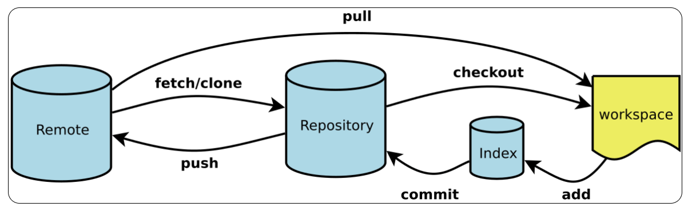
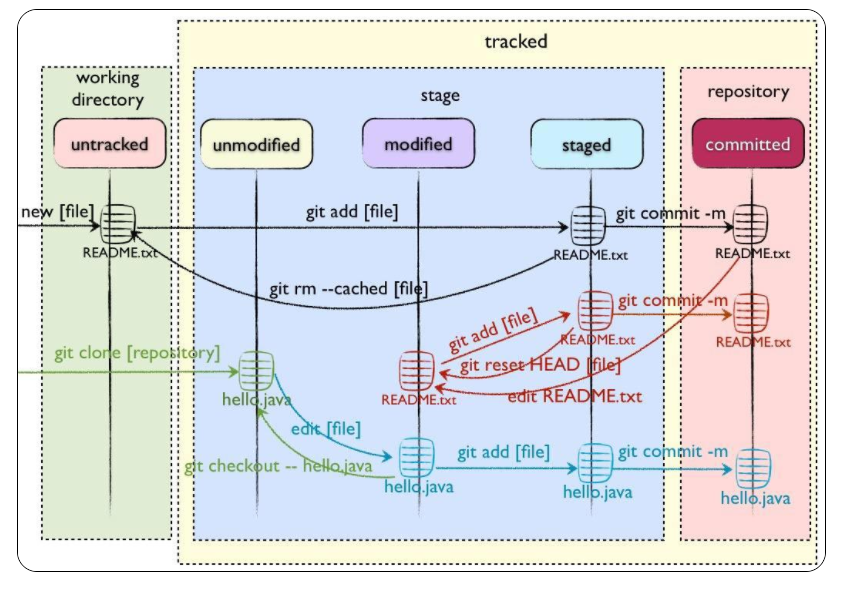

# git的简介

## 诞生

BitKeeper的东家BitMover公司出于人道主义精神，授权Linux社区免费使用这个版本控制系统。2005年就被打破了，原因是Linux社区牛人聚集，不免沾染了一些梁山好汉的江湖习气。开发Samba的Andrew试图破解BitKeeper的协议（这么干的其实也不只他一个），被BitMover公司发现了（监控工作做得不错！），于是BitMover公司怒了，要收回Linux社区的免费使用权。于是linux之父Linus，花了两周时间自己用C写了一个分布式版本控制系统，这就是Git。Git迅速成为最流行的分布式版本控制系统，尤其是2008年，GitHub网站上线了，它为开源项目免费提供Git存储，无数开源项目开始迁移至GitHub，包括jQuery，PHP，Ruby等等。

## 分布式和集中式

集中式和分布式的区别是：`你的本地是否有完整的版本库历史！`
假设SVN服务器没了，那你丢掉了所有历史信息，因为你的本地只有当前版本以及部分历史信息。假设GitHub服务器没了，你不会丢掉任何git历史信息，因为你的本地有完整的版本库信息。你可以把本地的git库重新上传到另外的git服务商。Git 其实就是每个人电脑上都装一个svn服务器，你写了代码提交到自己电脑服务器上就是Commit；但是如果你想多人协作，就要把你的改动发送到你**每一个同事 **的svn服务器上就是push；

**疑问：分布式的版本控系统如果要在多个人之间协作不也是需要一个像github一样的的远程版本库吗，这与集中式的有什么区别呢？**

答：假如你还有10个同事，你每一次更改都要提交10次，其他同事有更改也要分别向我们提交，是不是觉得好烦，所以我们说干脆找一台固定电脑（服务器）用来统一规定把修改推给这台电脑，这样只需要提交1次就行了，其他人去这台机器上同步就好了。Git的中央服务器可以没有，我们只是为了方便才这么做的。

# git的入门

## **git的工作区：**

git主要有4个工作区

- workspace：工作区，平时开发编写代码的地方。
- index：暂存区，当执行 `git add` 的命令后，工作区的文件就会被移入暂存区，暂存区标记了当前工作区中那些内容是被 Git 管理的，当完成某个需求或者功能后需要提交代码，第一步就是通过 `git add` 先提交到暂存区。
- repository：本地仓库，位于自己的电脑上，通过 `git commit` 提交暂存区的内容，会进入本地仓库。
- remote：：远程仓库，用来托管代码的服务器，远程仓库的内容能够被分布在多个地点的处于协作关系的本地仓库修改，本地仓库修改完代码后通过 `git push` 命令同步代码到远程仓库。



## **git 的工作流程：**

git的工作流程大体上分为4步

1. 在工作区开发，添加，修改文件。
2.  将修改后的文件放入暂存区。 
3. 将暂存区域的文件提交到本地仓库。 
4. 将本地仓库的修改推送到远程仓库。

## git文件的四种状态

- **`Untracked`:**  未跟踪, 此文件在文件夹中, 但并没有加入到git库, 不参与版本控制. 通过git add 状态变为Staged.
-  **`Unmodify`:**  文件已经入库但未修改， 即版本库中的文件快照内容与文件夹中完全一致。 这种类型的文件有两种去处, 如果它被修改, 而变为Modified，如果使用`git rm`移出版本库, 则成为Untracked文件
-  **`Modified`:** 文件已修改, 仅仅是修改，并没有进行其他的操作. 这个文件也有两个去处, 通过`git add`可进入暂存staged状态, 使用`git checkout` 则丢弃修改过，返回到unmodify状态，这个git checkout即从库中取出文件, 覆盖当前修改
-   **`Staged`:** 暂存状态. 执行`git commit`则将修改同步到库中， 这时库中的文件和本地文件又变为一致, 文件为Unmodify状态. 执行git reset HEAD filename取消暂存，文件状态为Modified



## git的基本使用

### 安装git

在Windows上使用Git，可以从Git官网直接[下载安装程序](https://git-scm.com/downloads)，然后按默认选项安装即可。

安装完成后，在开始菜单里找到“Git”->“Git Bash”，蹦出一个类似命令行窗口的东西，就说明Git安装成功！

```
$ git config --global user.name "Your Name"
$ git config --global user.email "email@example.com"
```

因为Git是分布式版本控制系统，所以，每个机器都必须自报家门：你的名字和Email地址。当你执行完以后，可以在C盘的用户文件路径下找到一个 `.gitconfig`的文件，里面是你配置的名字和邮箱地址8


### 创建版本库

- 创建一个空目录
- 用`git init`把目录变成Git可以管理的仓库

**为了避免遇到各种莫名其妙的问题，请确保目录名（包括父目录）不包含中文。**

```git
$ mkdir gitLearn
$ cd gitLearn
$ git init
```

### git的常见命令

`git status`：查看本地仓库的状态

`git add`：添加文件到index

```
# 添加某个文件到暂存区，后面可以跟多个文件，以空格区分
git add xxx
# 添加当前更改的所有文件到暂存区。
git add .
```

`git rm --cache` ：将文件从index中删除，rm是remove的缩写，工作区还是存在的。

`git commit`：将index中的文件提交到repository，形成历史版本

```
# 提交暂存的更改，会新开编辑器进行编辑
git commit 
# 提交暂存的更改，并记录下备注
git commit -m "you message"
# 等同于 git add . && git commit -m
git commit -am
# 对最近一次的提交的信息进行修改,此操作会修改commit的hash值
git commit --amend

```

`git log`：查看详细版本信息

```
#这两种都是log的显示格式
git log --pretty=online
git log --online
```

`git reflog`：查看精简版本信息

`git reset`：版本穿梭，

```
git reset --hard 版本对应的hash值（可以通过 git reflog来查看）
```

- --soft：在本地仓库移动head指针。
- --mixed：在本地仓库移动head指针，且重置暂存区。
- hard：在本地仓库移动head指针，重置暂存区和工作区。

`git diff`：将工作区的文件和暂存区的文件进行比较。

## git的分支操作

- 创建分支
  - `git branch  分支名` ：创建一个分支
- 查看分支
  - `git branch` ：列出当前分支清单
  - `git branch -a`：查看远程分支和本地分支
  - `git branch -v`：查看各个分支最后一个提交信息
  - `git branch --merged`：查看哪些分支已经合并入当前分支
- 切换分支
  - `git checkout 分支名`：切换分支查看哪些分支已经合并入当前分支
- 合并分支
  - 切换到接受修改的分支上
    - ` git checkout 接受修改的分支名`
  - 执行merge命令
    - `git merger 有新内容的分支名`
  - 举例，brandFile分支有新内容，要把brandFile的内容合并到masterFile分支
    - git checkout masterFile
    - git merger brandFile
- 解决冲突

# git连接github远程仓库

- 在github上成功创建一个仓库后，会获得远程仓库的url

  

- 使用`git remote add`来创建远程仓库别名

  ```
  git remote add origin https://github.com/jiechaoming/learningFile.git
  ```

  **origin**是你给远程仓库取的**别名**，后面的**url**是你**远程仓库的地址**。

- 使用`git push`命令将本地仓库的数据推送到远程仓库

  ```
  git push origin master
  ```

  **origin**是你给远程仓库取的**别名**，后面的**master**是你要推送的**分支名称**，当前推送主分支，所以用master。

- 此时你可能会遇到如下的错误提示

  `remote: Support for password authentication was removed on August 13, 2021. Please use a personal access token instead.`

  这是因为从21年8月13后不再支持用户名密码的方式验证了，需要创建个人访问令牌(personal access token)。

  [解决方案](https://blog.csdn.net/qq_42714262/article/details/119706383#:~:text=Please use a personal access token instead. 字面大体意思就是你原先的,凭证从 2021年8月 13日 开始就不能用了，必须使用个人访问令牌（personal access token），就是把你的 密码 替换成token！)

- 


