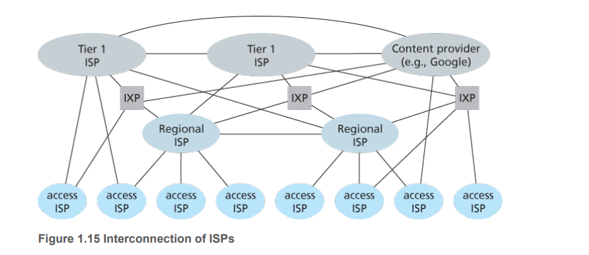

# 计算机网络和因特网 

## 什么是因特网

### 从具体构成描述

网络，计算机网络，因特网的区别

- 网络：由点和边构成，如蜘蛛网，社交网，神经网络
- 计算机网络
  - 节点：分目标节点，数据节点。目标节点是我们的端系统如手机，平板，桌面pc；数据节点是专门用于交换数据的节点如路由器，交换机，负载均衡设备。
  - 边：即数据链路，分为接入链路和骨干链路。接入链路是连接目标节点和数据节点；骨干链路是连接数据节点和数据节点
  - 协议：定义了两个对等的实体在通信过程中所要遵守的标准规范包括语法，语义，顺序，动作等。常见的协议又HTTP，TCP，UDP等
- 因特网：或者叫做互联网，是一个世界范围的计算机网络。他互联了全世界数十亿的计算机设备的网络。

### 从服务描述

因特网由分布式应用和为分布式应用进程提供通信服务的基础设施组成。基础设施通过socket，api为应用进程提供服务。

## 网络的边缘

### 网络的结构

从类型角度看，计算机网络包括三部分。网络边缘，网络核心，网络接入。网络边缘通过网络接入和网络核心相连接，从而和另一个网络边缘相通信。

### 网络边缘

#### 端系统

端系统也被叫做主机，主机又可以被进一步的划分成客户（client）和服务器（server），位于网络的边缘

#### 两种服务模式

- 客户/服务器模式（CS）：客户端向服务端请求接受服务，如web浏览器和服务器
- 对等模式（peer to peer）：每个端系统都是客户端和服务端。

#### 两种连接方式

- 采用网络设施的面向连接服务
  - 进行握手，创建连接
  - 利用TCP-传输控制协议。可靠（确认和重传），流量控制（发送方不会淹没接受方），拥塞控制（网络拥塞时，发送方降低发送频率）
  - 使用TCP的应用：HTTP，FTP，SMTP
- 采用网络设施的无连接服务
  - 利用UDP-用户数据报协议。无连接，不可靠，无流量控制，无拥塞控制
  - 采用UDP的应用：流媒体，远程会议

#### 端系统交互示意图

## 网络的核心

### 电路交换

两台主机在通信的时候，必须创建一条专用的端到端连接

#### 电路交换的特点

- 要求建立呼叫连接
- 通信资源独享，保证了性能，但相应的会浪费通信资源

#### 电路交换的方式

- 频分复用
- 时分复用

#### 电路交换不适合计算机之间的通信

- 连接建立时间长
- 计算机之间的通信有突发性，如果使用线路交换，则浪费的片比较多。
- 可靠性低，当主机数量多的时候，必须维护许多端到端的连接。

### 分组交换  

以分组为单位，进行存储-转发传输。端系统彼此间交互报文(message)，在分组交换中，会将长报文分割成较小的数据块，我们称之为分组(packet)。存储-转发传输是指，分组交换机在发送分组前，必须接收到整个分组。

#### 分组交换的特点

- 传输时使用全部的网络带宽
- 主机之间传输的数据被分为一个个分组
- 资源共享，按需分配

#### 排队时延和丢失

如果到达速率大于链路传输速率

- 分组将会排队，等待传输
- 如果路由器的缓存用完了，分组将会被抛弃。

#### 分组交换的方式

根据网络层是否有连接，分组交换可以分成数据报(datagram)和虚电路(virtual circuit)

- 数据报：
  - 通信前无需连接，有数据就传递
  - 每个分组都独立路由，路径可能不一样，可能会失序
  - 路由器根据分组中的目标地址进行路由
- 虚电路(有连接)
  - 通过信令来创建电路连接
  - 这个连接不仅仅是体现在源主机到目标主机，还体现在中间所经过的所有交换节点即交换节点参与连接的维护。
  - 这里注意下TCP，TCP是面向连接，仅仅体现在源主机到目标主机。两者间的交换节点是不会维护这个连接的。

### 网络核心的功能

- 路由：决定分组采用的源到目标的路径
- 转发：将分组从路由器的输入链路转移到输出链路

## 接入网和物理媒体

###  接入网的类型

#### 家庭接入

- DSL
- 电缆
- FTTH
- 拨号和卫星

#### 企业接入

#### 无线接入

### 物理媒体

- 导引型媒体，有形的介质，如双绞铜线，同轴电缆，光纤
- 非导引型媒体，无形的介质，电磁波

## Internet的结构和ISP

## 时延，丢包，吞吐量

### 时延的类型

- 处理时延(processing delay)：检查分组的首部，决定分组的去向等，这个时延通常是可以确定的。
- 排队时延(queuing delay)：
- 传输时延(transmission delay)
- 传播时延(propagation delay)

## 协议分层

### 层次化方式实现复杂网络功能

- 将网络复杂的功能分层功能明确的层次，每一层实现了其中一个或者一组功能，功能中有其上层可以使用的功能即`服务`
- 本层协议实体相互交互执行本层的协议动作，目的是实现本层功能。通过接口为上层提供更好的服务
- 在实现本层协议的时候，直接利用了下层所提供的服务
- 本层的服务：借助下层服务实现的本层协议实体之间交互带来的新功能（上层可以利用的）+更下层所提供的服务

例子：军队中，有师长、旅长、团长、营长、连长、排长、士兵，团长向旅长提供本层的服务，旅长通过接口调用团长提供的服务；团长向旅长提供的服务包括营长提供的服务和团长自身拓展的新服务。

### 服务和服务访问点

服务(service)：低层实体向上层实体提供他们之间的通信的能力

- 服务用户：service user
- 服务提供者：service provider

原语(primitive)：高层使用低层提供的服务，以及低层向高层提供服务都是通过服务访问原语来进行交互的。

服务访问点`SAP`(services access point)：上层用户在层间的接口来使用下层所提供的服务，服务访问点存在于层间接口中。上层用户可以有多个，多个用户调用同一个层间接口，为了区分相应的用户，每个用户都对应一个服务访问点。 

### 服务和协议

区别：

- 服务：低层实体向上层实体提供他们之间的通信的能力，是通过原语来操作的，垂直
- 协议：对等层实体之间在相互通信的过程中，需要遵顼的规则的集合，水平

联系：

- 本层协议的实现要靠下层提供的服务来实现
- 本层实体通过协议为上层提供更高级的服务
